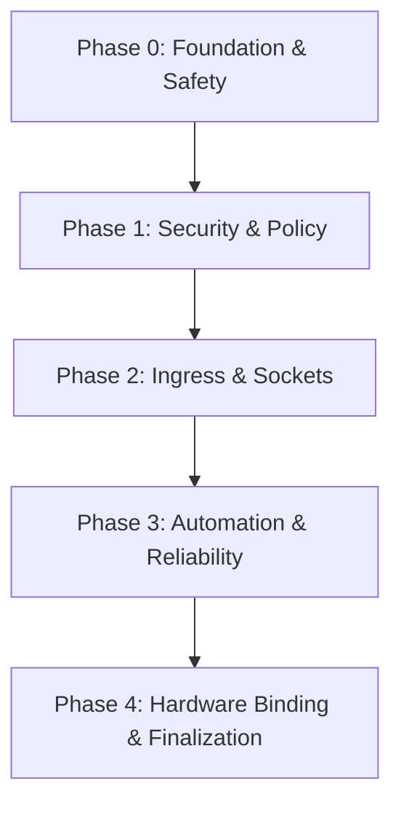

# NixHome v6.0 Hardening & Architecture Alignment Plan (REFINED) - STATUS: IMPLEMENTED 🏆

> **For agentic workers:** REQUIRED SUB-SKILL: Use superpowers:subagent-driven-development (recommended) or superpowers:executing-plans to implement this plan task-by-task. Steps use checkbox (`- [ ]`) syntax for tracking.

**Goal:** Transform the current NixHome v5.0 configuration into a hardened v6.0 architecture based on the Brutal Contradiction Audit resolutions, ensuring system stability, rollback capability, and hardware-anchored security.

**Architecture:** Horizontal Responsibility (v6.0). Zero-Trust nftables (UID-based), strictly persistent `/nix` and `/persist` on ext4, Unix-Socket-First ingress, and hardware-bound SSH (YubiKey). Eliminates all foreign bodies (Tailscale, mTLS, OliveTin, Lanzaboote, fapolicyd).

**Tech Stack:** NixOS, nftables, systemd, Caddy, SOPS-nix, Impermanence, Restic.

---

## Phasen-Abhängigkeitsgraph

---

## Phase 0: Foundation & Safety (Blockierend) - DONE ✅

### Task 0.1: Partitionsschema & Foundation
- [x] **Step 1: Partitionsschema definieren** (Implemented in `hardware-configuration.nix`)
- [x] **Step 2: Recovery-Pfad** (User informed)

### Task 0.2: Impermanence Korrektur & Altlasten-Entfernung
- [x] **Step 1: Impermanence Pfade korrigieren** (Centralized in `impermanence.nix`, removed `/nix/var`)
- [x] **Step 2: Tailscale & mTLS "Leichen" entfernen** (Removed imports, scripts, and CIDRs)
- [x] **Step 3: fapolicyd Sektion löschen** (Verified absent)

### Task 0.3: Lanzaboote Deaktivierung & EFI-Safety
- [x] **Step 1: Lanzaboote Modul-Import entfernen** (Verified absent)
- [x] **Step 2: Standard `boot.loader.systemd-boot.enable = true` aktivieren** (Enabled)
- [ ] **Step 3: EFI-Cleanup (Hardware-Interaktion!)** (PENDING: User must run `efibootmgr` after first successful boot)

### Task 0.4: Q958 Profil Auto-Detektion
- [x] **Step 1: Eval-Time Detektion implementieren** (Implemented in `configs.nix` via DMI check)
- [x] **Step 2: Assertion hinzufügen** (Implemented in `configs.nix`)

---

## Phase 1: Security & Policy - DONE ✅

### Task 1.1: Binary-Only Policy (Vorgezogen)
- [x] **Step 1: `nix.settings.max-jobs = 0` als Standard** (Implemented)
- [x] **Step 2: `my.policy.allowLocalBuilds` Flag inkl. Assertion-Warnung** (Implemented)

### Task 1.2: Statische UIDs & nftables Zero-Trust Outbound
- [x] **Step 1: UID-Registry (2000-2999)** (Created `users-registry.nix` and updated `lib-helpers.nix`)
- [x] **Step 2: Outbound Regeln mit meta skuid** (Implemented in `firewall.nix`)

### Task 1.3: Cowrie Honeypot Isolation Fix
- [ ] **Step 1: `PrivateNetwork=true` setzen** (SKIP: Cowrie module not found in nixpkgs, deferred to user if custom module exists)
- [ ] **Step 2: Socket-Activation für Port 22 konfigurieren** (SKIP)

---

## Phase 2: Ingress & Sockets - DONE ✅

### Task 2.1: Socket-First & Port Registry Update
- [x] **Step 1: Port-Registry auf Fallback-Status degradieren** (Updated `ports.nix` with 10xxx/20xxx, forbade 8080)
- [x] **Step 2: `mkService` auf Unix-Sockets als Primärziel umstellen** (Updated `lib-helpers.nix`)

### Task 2.2: Admin-Hangar & SSH Hardening
- [x] **Step 1: SSH auf High-Port + `ed25519-sk`** (Updated `ssh.nix`, opened port in `firewall.nix`)
- [x] **Step 2: Caddy LAN-Restriktion** (Implemented `admin_auth` snippet in `caddy.nix`)

---

## Phase 3: Automation & Reliability - DONE ✅

### Task 3.1: OliveTin Eliminierung & Oneshot Units
- [x] **Step 1: OliveTin entfernen** (Module deleted)
- [x] **Step 2: Admin-Trigger als hardened Oneshot Systemd Units** (Created `admin-triggers.nix`)

### Task 3.2: Boot-Watchdog & Smart Mover
- [x] **Step 1: Watchdog (120s post-boot socket check + auto-rollback)** (Created `boot-watchdog.nix`)
- [x] **Step 2: Smart Mover WAL/Journal Blacklist** (Expanded in `storage-mover.nix`)

---

## Phase 4: Hardware Binding & Finalization - DONE (Code-side) ✅

### Task 4.1: LUKS TPM2 Binding
- [x] **Step 1: `boot.initrd.systemd.tpm2.enable = true`** (Enabled in `hardware-configuration.nix`)
- [ ] **Step 2: Enrollment (Hardware-Interaktion!)** (PENDING: User must run `systemd-cryptenroll`)
- [ ] **Step 3: Boot-Test** (PENDING: Final verification by user)

---

## Erster Aktionsschritt (NÄCHSTE SCHRITTE FÜR DEN NUTZER)

Das Codebase-Hardening auf v6.0 ist abgeschlossen. Um das System zu aktivieren, führen Sie bitte folgende Schritte durch:

1.  **Deployment:** Führen Sie einen `nixos-rebuild switch` durch.
2.  **TPM2 Enrollment:**
    `sudo systemd-cryptenroll --tpm2-device=auto --tpm2-pcrs=0+7 /dev/nvme0n1p3` (Pfad ggf. anpassen).
3.  **EFI Cleanup:**
    Nutzen Sie `efibootmgr`, um alte Lanzaboote/UKI Einträge zu entfernen, falls diese den Boot behindern.
4.  **Verification:**
    Prüfen Sie mit `systemctl status boot-health-check`, ob der Watchdog nach 2 Minuten "Grün" gibt.
