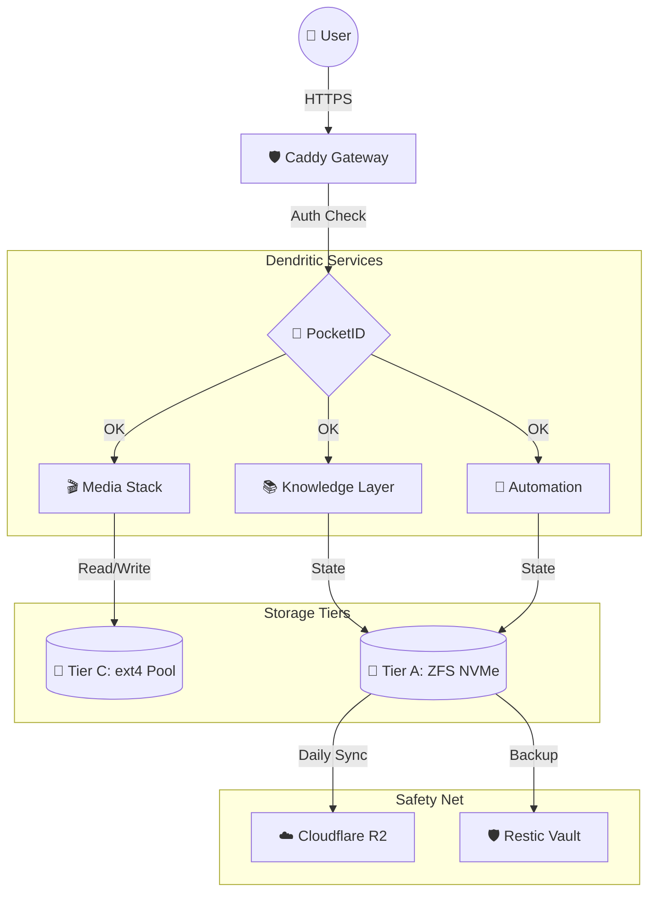

# 📐 mynixos: Die visuelle Architektur

Dieses Dokument dient als Test für den automatischen Mermaid-Renderer. Es zeigt den Datenfluss durch deinen Tower.

## 🚀 SRE-Anwendung
Wenn du dieses File in GitHub öffnest, sollte das Diagramm oben als professionelle Grafik erscheinen. Dies ist der neue Standard für alle ADRs in mynixos.
