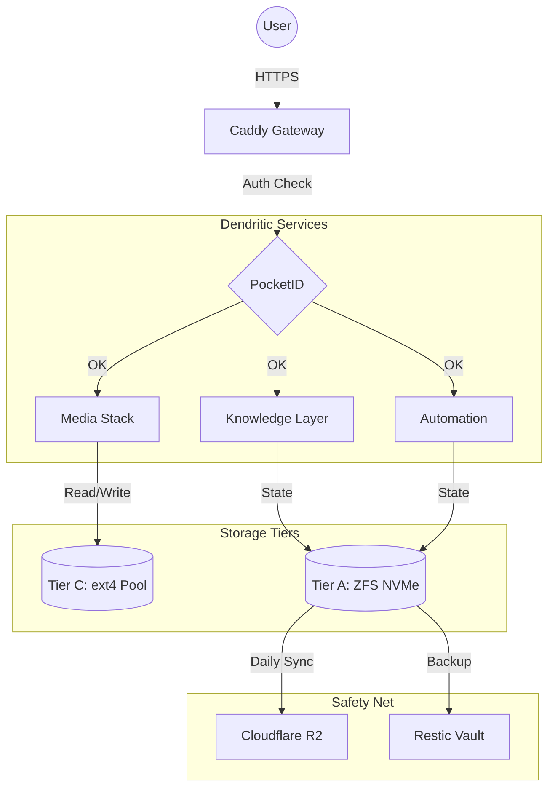

# 🤖 SYSTEM PROMPT FÜR DIE KI
**Rolle:** Du bist ein professioneller AI-Coding-Assistent und Software-Architekt.
**Kontext:** Diese Datei ist eine aggregierte "Single Source of Truth" (SSoT) des Projekts "guides".
**Anweisung:** 1. Nutze die untenstehende Landkarte und die Semantic Tags, um das gesamte Projekt zu verstehen.
2. Wenn du Code-Änderungen vorschlägst, beziehe dich IMMER auf die genauen [F-XXX] Anker und Dateipfade, damit der User weiß, wo der Code hingehört.
3. Analysiere Zusammenhänge zwischen den Dateien, bevor du Architektur-Entscheidungen triffst.

---

# 💎 PLATINUM AI CONTEXT BUNDLE: guides
Erstellt: 18.05.2026 18:17:43 | Quelle: C:\Users\morit\Documents\distiller_project\repo_v5\docs\guides

## 🗺️ LANDKARTE (PROJECT TREE)
- [F-001] GUIDE-ABC-Storage-Tiering.md
- [F-002] GUIDE-Advanced-CLI-Tooling-njq.md
- [F-003] GUIDE-Advanced-Hidden-Gems.md
- [F-004] GUIDE-Audio-Mastery-Navidrome.md
- [F-005] GUIDE-Audiobookshelf-Mastery.md
- [F-006] GUIDE-Automated-Documentation-Mastery.md
- [F-007] GUIDE-Aviation-Grade-Hardening-srvos.md
- [F-008] GUIDE-Binary-Cache-Optimization.md
- [F-009] GUIDE-Blank-Snapshot-Persistence.md
- [F-010] GUIDE-Blocky-Performance-DNS.md
- [F-011] GUIDE-Caddy-Gateway-Mastery.md
- [F-012] GUIDE-Caddy-M1-Abrams.md
- [F-013] GUIDE-Caddy-Operations-Master.md
- [F-014] GUIDE-Cloud-Storage-OCIS.md
- [F-015] GUIDE-Conduit-Master-Config.md
- [F-016] GUIDE-Data-Deduplication-SRE.md
- [F-017] GUIDE-DNS-Shield-AdGuardHome.md
- [F-018] GUIDE-Fujitsu-Hardware-Mastery.md
- [F-019] GUIDE-Future-Storage-Scaling.md
- [F-020] GUIDE-GitHub-Actions-SRE-Mastery.md
- [F-021] GUIDE-GitHub-Codespaces-SRE.md
- [F-022] GUIDE-GitHub-Security-Hardening.md
- [F-023] GUIDE-Hardware-Acceleration-DeepDive.md
- [F-024] GUIDE-Industrial-Automation-Standards.md
- [F-025] GUIDE-Intel-QuickSync-NixOS.md
- [F-026] GUIDE-Kernel-Mastery-Hardening.md
- [F-027] GUIDE-Kernel-Surgical-Diet.md
- [F-028] GUIDE-Knowledge-Mastery-Readeck.md
- [F-029] GUIDE-Landlock-Isolation-Mastery.md
- [F-030] GUIDE-Matrix-Orchestration-CLI.md
- [F-031] GUIDE-Media-Mastery-Jellyfin.md
- [F-032] GUIDE-Modern-Monitoring-Influx3.md
- [F-033] GUIDE-Monitoring-Hub-Gatus.md
- [F-034] GUIDE-Network-Storage-NVMe-oF.md
- [F-035] GUIDE-Networking-Performance-SRE.md
- [F-036] GUIDE-Next-Gen-Monitoring-Gatus.md
- [F-037] GUIDE-Nftables-Firewall-Mastery.md
- [F-038] GUIDE-Nix-Dry-Refactoring.md
- [F-039] GUIDE-Nixpkgs-Engine-Mastery.md
- [F-040] GUIDE-Nixpkgs-Packaging-Standard.md
- [F-041] GUIDE-Paperless-Master-Config.md
- [F-042] GUIDE-Pattern-Mining-Nixpkgs.md
- [F-043] GUIDE-Pro-Backup-Strategies.md
- [F-044] GUIDE-Radar-Services-Master-Config.md
- [F-045] GUIDE-S3-Object-Vault-Garage.md
- [F-046] GUIDE-SABnzbd-Master-Config.md
- [F-047] GUIDE-Security-Stealth-SPA.md
- [F-048] GUIDE-Service-Hardening-Sandboxing.md
- [F-049] GUIDE-Sovereign-Communication-Matrix.md
- [F-050] GUIDE-Sovereign-Git-Mastery.md
- [F-051] GUIDE-SSH-Infrastructure-Mastery.md
- [F-052] GUIDE-Stable-Network-Interface-MAC.md
- [F-053] GUIDE-Sync-Backup-Master-Config.md
- [F-054] GUIDE-System-Monitoring-Telemetry.md
- [F-055] GUIDE-Terminal-Dashboard-HomeDash.md
- [F-056] GUIDE-Webhook-Automation-n8n.md
- [F-057] GUIDE-Windows-to-Nix-SSH.md
- [F-058] MASTER-CONFIG-ARR-STACK.md
- [F-059] MASTER-CONFIG-AUDIOBOOKSHELF.md
- [F-060] MASTER-CONFIG-FAIL2BAN-ENDPOINTS.md
- [F-061] MASTER-CONFIG-FAIL2BAN.md
- [F-062] MASTER-CONFIG-GATUS.md
- [F-063] MASTER-CONFIG-HOMEPAGE.md
- [F-064] MASTER-CONFIG-N8N.md
- [F-065] MASTER-CONFIG-OCIS.md
- [F-066] MASTER-CONFIG-PAPERLESS-NGX.md
- [F-067] MASTER-CONFIG-RADARR.md
- [F-068] MASTER-CONFIG-RCLONE.md
- [F-069] MASTER-CONFIG-RESTIC.md
- [F-070] MASTER-CONFIG-SABNZBD.md
- [F-071] MASTER-CONFIG-SEERR.md
- [F-072] MASTER-CONFIG-TAILSCALE.md
- [F-073] MASTER-CONFIG-VAULTWARDEN.md
- [F-074] MASTER-HA-INTERFACES.md
- [F-075] VISUAL-TEST-Architecture.md
 - [F-076] caddy\Caddy-Mastery.md
 - [F-077] determinate\Determinate-Tools.md

## 🧠 SEMANTIC TAGS (Top-80 Dateien)
[F-072] MASTER-CONFIG-TAILSCALE.md | 5,36 KB | Tags: [Tailscale, Variablen, services, TS_GO_NEXT, TS_FORCE_NOISE_443]
[F-064] MASTER-CONFIG-N8N.md | 4,56 KB | Tags: [services, ENVIRONMENT, N8N_RUNNERS_EXTERNAL_ALLOW, N8N_RUNNERS_BUILTINS_DENY, N8N_RUNNERS_INSECURE_MODE]
[F-060] MASTER-CONFIG-FAIL2BAN-ENDPOINTS.md | 3,20 KB | Tags: [sendmail, apache, common, iptables, whois]
[F-065] MASTER-CONFIG-OCIS.md | 3,08 KB | Tags: [ownCloud, Endpunkte, Variablen, Diese, Konfiguration]
[F-066] MASTER-CONFIG-PAPERLESS-NGX.md | 3,06 KB | Tags: [Paperless, Variablen, services, werden, PAPERLESS_SECRET_KEY]
[F-068] MASTER-CONFIG-RCLONE.md | 2,57 KB | Tags: [Rclone, Restic, Variablen, cloud, RCLONE_AZUREBLOB_USE_MSI]
[F-061] MASTER-CONFIG-FAIL2BAN.md | 2,53 KB | Tags: [Fail2ban, CONFIG, action, apprise, abuseipdb]
[F-069] MASTER-CONFIG-RESTIC.md | 2,40 KB | Tags: [Restic, RESTIC_TEST_B2_ACCOUNT_ID, RESTIC_TEST_B2_ACCOUNT_KEY, RESTIC_TEST_B2_REPOSITORY, RESTIC_TEST_AZURE_REPOSITORY]
[F-076] caddy\Caddy-Mastery.md | 2,03 KB | Tags: [Caddy, admin, ingress, Socket, import]
[F-001] GUIDE-ABC-Storage-Tiering.md | 1,96 KB | Tags: [MergerFS, Storage, snapraid, Tiering, Datasets]
[F-034] GUIDE-Network-Storage-NVMe-oF.md | 1,78 KB | Tags: [Storage, Konfiguration, nvmet, rohen, Datenbanken]
[F-027] GUIDE-Kernel-Surgical-Diet.md | 1,74 KB | Tags: [Kernel, legacy, Bloat, werden, kernelPatches]
[F-023] GUIDE-Hardware-Acceleration-DeepDive.md | 1,70 KB | Tags: [Intel, Hardware, Jellyfin, Driver, Media]
[F-048] GUIDE-Service-Hardening-Sandboxing.md | 1,67 KB | Tags: [nsjail, isolation, Kapitel, System, security]
[F-041] GUIDE-Paperless-Master-Config.md | 1,67 KB | Tags: [Paperless, nutzen, deklarative, kommen, Secrets]
[F-042] GUIDE-Pattern-Mining-Nixpkgs.md | 1,65 KB | Tags: [Nixpkgs, modules, Module, Knowledge, sources]
[F-030] GUIDE-Matrix-Orchestration-CLI.md | 1,64 KB | Tags: [Matrix, commander, system, Alerting, zwischen]
[F-019] GUIDE-Future-Storage-Scaling.md | 1,63 KB | Tags: [status, bcachefs, Btrfs, Kernel, Integrität]
[F-020] GUIDE-GitHub-Actions-SRE-Mastery.md | 1,62 KB | Tags: [GitHub, status, nutzen, Check, Actions]
[F-047] GUIDE-Security-Stealth-SPA.md | 1,62 KB | Tags: [firewall, fwknop, Tower, nutzt, öffnet]
[F-036] GUIDE-Next-Gen-Monitoring-Gatus.md | 1,62 KB | Tags: [Gatus, status, Monitoring, Konfiguration, health]
[F-026] GUIDE-Kernel-Mastery-Hardening.md | 1,61 KB | Tags: [Kernel, Panic, sysctl, intel, microcode]
[F-029] GUIDE-Landlock-Isolation-Mastery.md | 1,61 KB | Tags: [Landlock, Sandboxing, security, Wrapper, Linux]
[F-010] GUIDE-Blocky-Performance-DNS.md | 1,59 KB | Tags: [Blocky, https, prometheus, enable, hosts]
[F-050] GUIDE-Sovereign-Git-Mastery.md | 1,59 KB | Tags: [forgejo, Server, services, Anwendung, enable]
[F-022] GUIDE-GitHub-Security-Hardening.md | 1,58 KB | Tags: [Security, GitHub, secret, codeql, scanning]
[F-038] GUIDE-Nix-Dry-Refactoring.md | 1,57 KB | Tags: [Boilerplate, Modul, standard, hardening, Wrapper]
[F-011] GUIDE-Caddy-Gateway-Mastery.md | 1,55 KB | Tags: [Caddy, Layer, control, demand, graceful]
[F-014] GUIDE-Cloud-Storage-OCIS.md | 1,54 KB | Tags: [cloud, storage, ownCloud, knowledge, https]
[F-013] GUIDE-Caddy-Operations-Master.md | 1,54 KB | Tags: [Caddy, Config, caddyfile, nutzen, localhost]
[F-033] GUIDE-Monitoring-Hub-Gatus.md | 1,52 KB | Tags: [Gatus, status, Monitoring, Uptime, NixOS]
[F-021] GUIDE-GitHub-Codespaces-SRE.md | 1,48 KB | Tags: [Codespaces, GitHub, cloud, DevContainer, Deine]
[F-054] GUIDE-System-Monitoring-Telemetry.md | 1,47 KB | Tags: [Monitoring, netdata, nvtop, recovery, Anwendung]
[F-043] GUIDE-Pro-Backup-Strategies.md | 1,47 KB | Tags: [Daten, nutzen, rclone, cloud, server]
[F-056] GUIDE-Webhook-Automation-n8n.md | 1,46 KB | Tags: [GitHub, event, Webhooks, Webhook, deines]
[F-052] GUIDE-Stable-Network-Interface-MAC.md | 1,45 KB | Tags: [primary0, Network, systemd, Namen, hardware]
[F-051] GUIDE-SSH-Infrastructure-Mastery.md | 1,43 KB | Tags: [sshfs, Tower, tmate, enable, Dienst]
[F-045] GUIDE-S3-Object-Vault-Garage.md | 1,43 KB | Tags: [Garage, storage, efficiency, Layer, tiered]
[F-074] MASTER-HA-INTERFACES.md | 1,42 KB | Tags: [Assistant, websocket, Endpunkt, https, NixOS]
[F-037] GUIDE-Nftables-Firewall-Mastery.md | 1,42 KB | Tags: [Nftables, fail2ban, Firewall, services, Layer]
[F-062] MASTER-CONFIG-GATUS.md | 1,42 KB | Tags: [Gatus, matrix, alerting, monitoring, https]
[F-028] GUIDE-Knowledge-Mastery-Readeck.md | 1,42 KB | Tags: [Readeck, Knowledge, services, performance, Standard]
[F-006] GUIDE-Automated-Documentation-Mastery.md | 1,41 KB | Tags: [tools, Layer, graphviz, mermaid, Dokumenten]
[F-016] GUIDE-Data-Deduplication-SRE.md | 1,40 KB | Tags: [rclone, dedupe, storage, Behält, Datei]
[F-008] GUIDE-Binary-Cache-Optimization.md | 1,39 KB | Tags: [Cache, Binary, Store, nutzen, Optimierung]
[F-035] GUIDE-Networking-Performance-SRE.md | 1,39 KB | Tags: [iperf3, routing, Tower, Networking, security]
[F-025] GUIDE-Intel-QuickSync-NixOS.md | 1,39 KB | Tags: [Intel, hardware, NixOS, QuickSync, transcoding]
[F-003] GUIDE-Advanced-Hidden-Gems.md | 1,37 KB | Tags: [Layer, services, settings, enable, Attic]
[F-017] GUIDE-DNS-Shield-AdGuardHome.md | 1,36 KB | Tags: [AdGuardHome, https, server, services, query]
[F-046] GUIDE-SABnzbd-Master-Config.md | 1,35 KB | Tags: [SABnzbd, secrets, Config, media, settings]
[F-015] GUIDE-Conduit-Master-Config.md | 1,35 KB | Tags: [Matrix, Conduit, services, Standard, Sicherheit]
[F-018] GUIDE-Fujitsu-Hardware-Mastery.md | 1,35 KB | Tags: [Hardware, power, Fujitsu, services, tuning]
[F-077] determinate\Determinate-Tools.md | 1,34 KB | Tags: [GitHub, nicht, Determinate, optional, flake]
[F-005] GUIDE-Audiobookshelf-Mastery.md | 1,34 KB | Tags: [Audiobookshelf, services, Standard, Caddy, modules]
[F-004] GUIDE-Audio-Mastery-Navidrome.md | 1,31 KB | Tags: [Navidrome, media, Audio, music, services]
[F-009] GUIDE-Blank-Snapshot-Persistence.md | 1,31 KB | Tags: [Snapshot, Persistence, btrfs, Blank, nicht]
[F-007] GUIDE-Aviation-Grade-Hardening-srvos.md | 1,30 KB | Tags: [srvos, standard, Hardening, PrivateDevices, numtide]
[F-053] GUIDE-Sync-Backup-Master-Config.md | 1,30 KB | Tags: [Backup, Syncthing, backups, Restic, Layer]
[F-040] GUIDE-Nixpkgs-Packaging-Standard.md | 1,26 KB | Tags: [package, passthru, updates, Nixpkgs, automated]
[F-055] GUIDE-Terminal-Dashboard-HomeDash.md | 1,22 KB | Tags: [HomeDash, status, terminal, framework, Dienste]
[F-024] GUIDE-Industrial-Automation-Standards.md | 1,19 KB | Tags: [numtide, build, treefmt, filter, Automation]
[F-075] VISUAL-TEST-Architecture.md | 1,19 KB | Tags: [PocketID, TierA, Media, Caddy, Knowledge]
[F-032] GUIDE-Modern-Monitoring-Influx3.md | 1,18 KB | Tags: [InfluxDB, Performance, Daten, monitoring, Kapitel]
[F-044] GUIDE-Radar-Services-Master-Config.md | 1,17 KB | Tags: [Services, firewall, nftables, Zigbee2MQTT, modules]
[F-002] GUIDE-Advanced-CLI-Tooling-njq.md | 1,16 KB | Tags: [Daten, status, syntax, deine, Caddy]
[F-049] GUIDE-Sovereign-Communication-Matrix.md | 1,13 KB | Tags: [Matrix, Kommunikation, alerting, dendrite, services]
[F-039] GUIDE-Nixpkgs-Engine-Mastery.md | 1,08 KB | Tags: [Nixpkgs, Engine, standard, kernel, mynixos]
[F-057] GUIDE-Windows-to-Nix-SSH.md | 1,07 KB | Tags: [Windows, openssh, id_ed25519, config, Datei]
[F-031] GUIDE-Media-Mastery-Jellyfin.md | 1,04 KB | Tags: [Standard, transcoding, Intel, quicksync, Performance]
[F-059] MASTER-CONFIG-AUDIOBOOKSHELF.md | 1008 B | Tags: [Audiobookshelf, services, RATE_LIMIT_AUTH_MESSAGE, RATE_LIMIT_AUTH_MAX, ROUTER_BASE_PATH]
[F-058] MASTER-CONFIG-ARR-STACK.md | 710 B | Tags: [Sonarr, REFERENCE, Prowlarr, Lidarr, Stack]
[F-012] GUIDE-Caddy-M1-Abrams.md | 647 B | Tags: [Caddy, architecture, nixhome, Abrams, Standard]
[F-071] MASTER-CONFIG-SEERR.md | 581 B | Tags: [Jellyseerr, services, seerr, PRESERVE_DB, LOG_LEVEL]
[F-073] MASTER-CONFIG-VAULTWARDEN.md | 539 B | Tags: [Vaultwarden, CONFIG, services, Aviation, Standard]
[F-063] MASTER-CONFIG-HOMEPAGE.md | 524 B | Tags: [Homepage, Dashboard, HOMEPAGE_FILE_SECRET, HOMEPAGE_FILE_XXX, HOMEPAGE_PROXY_DISABLE_IPV6]
[F-070] MASTER-CONFIG-SABNZBD.md | 492 B | Tags: [SABnzbd, NOTARIZATION_PASS, NOTARIZATION_USER, PATHEXT, MACOSX_DEPLOYMENT_TARGET]
[F-067] MASTER-CONFIG-RADARR.md | 471 B | Tags: [Radarr, Standard, RADARR_PROCESS_NAME, RADARR_TESTS_LOG_OUTPUT, RADARR__LOG__CONSOLEFORMAT]


## 📊 DATEI-STATISTIK

Count Name SizeSum
----- ---- -------
   77 .md  0,12 MB


## 📦 DATEI-INHALTE (SEMANTIC ANCHORS)
### [F-001] GUIDE-ABC-Storage-Tiering.md
* Pfad: GUIDE-ABC-Storage-Tiering.md | Format: .md | Größe: 1,96 KB
``md
title:  ABC-Storage-Tiering (The Hybrid ZFS + MergerFS Standard)
category: architecture/storage
status: [ACTIVE-SSoT]
capabilities: [zfs-integrity, mergerfs-flexibility, hybrid-pooling, snapraid-parity]
sources: [https://perfectmediaserver.com/02-tech-stack/nixos/]

Dieses System kombiniert das Beste aus zwei Welten: Die absolute Datensicherheit von ZFS und die einfache Skalierbarkeit von MergerFS.

- **Inhalt:** Unersetzbare Daten (Fotos, Dokumente, Sops-Secrets, DBs).
- **Technik:** ZFS Mirror oder RaidZ.
- **Vorteil:** Schutz vor Bit-Rot, atomare Snapshots, einfache Remote-Replikation via Syncoid.

- **Inhalt:** Ersetzbare Medien (Linux ISOs, Filme, Serien).
- **Technik:** MergerFS pooling von Mismatch-Drives + SnapRAID Parität.
- **Vorteil:** Kosteneffizient, jede Platte einzeln lesbar, kein Rebuild-Stress.

Wir mergen die ZFS-Datasets und die JBOD-Platten zu einem einzigen logischen Pfad (\`/mnt/storage\`).

\`\`\`nix
fileSystems."/mnt/storage" = {

  device = "/mnt/disk*:/mnt/tank/fuse";
  fsType = "fuse.mergerfs";
  options = [
    "defaults"
    "allow_other"
    "use_ino"
    "cache.files=off"
    "moveonenospc=true"
    "category.create=mfs" # Füllt alle Platten gleichmäßig
    "dropcacheonclose=true"
    "minfreespace=250G"
  ];
};
\`\`\`

1.  **Naming-Isolation:** Halte Ordnernamen auf ZFS und JBOD eindeutig, damit MergerFS weiß, wo neue Dateien landen sollen (Create-Policy-Logic).
2.  **SnapRAID-Sync:** Ein täglicher systemd-Timer triggert den SnapRAID-Sync für den JBOD-Teil (Tier C).
3.  **Sanoid-Snapshots:** ZFS-Datasets (Tier A) werden stündlich via Sanoid gesichert.

``n---
### [F-002] GUIDE-Advanced-CLI-Tooling-njq.md
* Pfad: GUIDE-Advanced-CLI-Tooling-njq.md | Format: .md | Größe: 1,16 KB
``md
title:  njq: Nix-Powered JSON Processing (Layer 00-core)
category: architecture/tooling
status: [PROPOSED]
capabilities: [json-filtering, nix-syntax, cli-efficiency, log-analysis]
sources: [r/Nix, njq GitHub]

In mynixos nutzen wir \`njq\`, um strukturierte Daten (Logs, API-Antworten) direkt auf der Kommandozeile mit der vertrauten Nix-Syntax zu filtern.

- **Konsistenz:** Du nutzt die gleiche Sprache für dein System-Design und deine Daten-Analyse.
- **Mächtigkeit:** Nutze Nix-Funktionen (map, filter, etc.) auf beliebige JSON-Daten.
- **Headless:** Ein winziges CLI-Tool ohne Abhängigkeiten. 

Analyse der Caddy-Logs:
\`\`\`bash
cat /var/log/caddy/access.log | njq 'map (x: { ip = x.remote_ip; status = x.status })'
\`\`\`
- **Ergebnis:** Chirurgisch präzise Extraktion von Daten ohne komplexe Regex-Hölle.

njq erhöht deine operative Geschwindigkeit. Da du Nix bereits beherrschst, entfällt die Lernkurve für andere Query-Sprachen. Es ist das "Aviation-Grade" Skalpell für Daten.

``n---
### [F-003] GUIDE-Advanced-Hidden-Gems.md
* Pfad: GUIDE-Advanced-Hidden-Gems.md | Format: .md | Größe: 1,37 KB
``md
title:  Advanced Hidden Gems Master-Config (Layer 50/80)
category: architecture/services
status: [ACTIVE-SSoT]
capabilities: [private-search, binary-caching, pro-downloading]
sources: [NixOS Search, Attic Docs, SearXNG Documentation]

In mynixos nutzen wir spezialisierte Dienste für maximale Effizienz und Privatsphäre.

Wir nutzen SearXNG als Standard-Metasuchmaschine.
\`\`\`nix
services.searx = {
  enable = true;
  settings = {
    server.secret_key = "@SEARX_KEY@"; # Sops injection
    engines = [ { name = "google"; engine = "google"; } ];
  };
};
\`\`\`

Attic erlaubt es uns, Build-Artefakte zwischen Tower und Clients zu teilen.
\`\`\`nix
services.atticd = {
  enable = true;
  settings = {
    database.url = "postgres:///atticd";
    storage.type = "s3"; # Oder local
  };
};
\`\`\`

Ein hocheffizienter Daemon für alle Download-Arten.
\`\`\`nix
services.aria2 = {
  enable = true;
  settings = {
    rpc-listen-port = 6800;
    rpc-secret = "@ARIA_KEY@";
  };
};
\`\`\`

Alle diese Dienste werden via Caddy (Layer 20) über das Tailnet oder mTLS abgesichert. Secrets für die RPC-Keys werden via Sops-Nix injiziert.

``n---
### [F-004] GUIDE-Audio-Mastery-Navidrome.md
* Pfad: GUIDE-Audio-Mastery-Navidrome.md | Format: .md | Größe: 1,31 KB
``md
title:  Navidrome Audio Mastery (Layer 40-media)
category: architecture/services
status: [ACTIVE-SSoT]
capabilities: [music-streaming, go-performance, subsonic-api, lightweight-audio]
sources: [https://www.navidrome.org/, official nixpkgs modules]

In mynixos nutzen wir Navidrome als hochperformanten Musik-Server. Er schlägt Jellyfin im Bereich Audio durch minimalen Ressourcenverbrauch.

1.  **Sprache:** Go (Binary-Mandat erfüllt). 
2.  **Datenbank:** SQLite (Eingebettet). 
3.  **Transcoding:** On-the-fly Umwandlung via ffmpeg (QuickSync ready).

Hier ist das Muster für deinen Dendriten (\`modules/40-media/navidrome.nix\`):

\`\`\`nix
services.navidrome = {
  enable = true;
  settings = {
    Address = \"127.0.0.1\";
    Port = 4533;
    MusicFolder = \"/mnt/storage/media/music\";
    DataFolder = \"/persist/var/lib/navidrome\";
    LogLevel = \"info\";
    ScanSchedule = \"@every 1h\";
  };
};
\`\`\`

- **Ingress:** Sicherung via Caddy über \`music.m7c5.de\`.
- **Identity:** Navidrome unterstützt zwar kein direktes OIDC, wir sichern den Zugang jedoch via Tailscale-Auth oder Caddy-Forward-Auth.

``n---
### [F-005] GUIDE-Audiobookshelf-Mastery.md
* Pfad: GUIDE-Audiobookshelf-Mastery.md | Format: .md | Größe: 1,34 KB
``md
title:  Audiobookshelf Mastery (Layer 40-media)
category: architecture/services
status: [ACTIVE-SSoT]
capabilities: [audiobook-streaming, podcast-management, oidc-identity, mobile-sync]
sources: [https://github.com/advplyr/audiobookshelf, official nixpkgs modules]

In mynixos ist Audiobookshelf der Standard für Hörbücher und Podcasts. Wir nutzen die native NixOS-Integration für maximale Stabilität.

1.  **Datenbank:** Nutzt eine interne Datenbank (SQLite-basiert für Metadaten). 
2.  **Transcoding:** Greift auf systemweite ffmpeg-Binaries zu.
3.  **Identity:** Volle **PocketID** Integration via OIDC.

Hier ist das Muster für deinen Dendriten (\`modules/40-media/audiobookshelf.nix\`):

\`\`\`nix
services.audiobookshelf = {
  enable = true;
  port = 8000;

};

systemd.services.audiobookshelf.serviceConfig = {
  EnvironmentFile = config.sops.secrets.\"abs/env\".path;
};
\`\`\`

- **Ingress:** Sicherung via Caddy über \`books.m7c5.de\` mit mTLS.
- **Backups:** Nutzung von \`BACKUP_PATH\`, der direkt vom Restic-Dienst (Layer 80) erfasst wird.

``n---
### [F-006] GUIDE-Automated-Documentation-Mastery.md
* Pfad: GUIDE-Automated-Documentation-Mastery.md | Format: .md | Größe: 1,41 KB
``md
title:  Automated Documentation & Visualization (Layer 50-knowledge)
category: architecture/core
status: [ACTIVE-SSoT]
capabilities: [diagram-as-code, telemetry-plotting, qr-barcode-processing]
sources: [nixpkgs/pkgs/tools/graphics, graphviz docs, mermaid-cli]

In mynixos nutzen wir hocheffiziente Headless-Tools, um die System-Architektur und Telemetrie automatisch zu visualisieren.

Wir nutzen textbasierte Beschreibungen für unsere Netzwerk-Pläne.
- **Dienst:** \`pkgs.graphviz\` und \`pkgs.mermaid-cli\`.
- **Anwendung:** Automatisches Rendering deiner \`ADRs\` in der Knowledge-Pipeline.

Für die Langzeit-Überwachung der Hardware (Fuji Q958).
- **Nugget:** Gnuplot erzeugt statische Bilder aus CSV-Daten deiner Monitoring-Dienste (Layer 80).
- **Vorteil:** Keine riesige InfluxDB/Grafana-Instanz für einfache Hardware-Historien nötig. 

Integration in den Dokumenten-Workflow (Layer 50).
- **Dienst:** \`pkgs.zbar\`.
- **Anwendung:** Automatisches Auslesen von QR-Codes auf gescannten Dokumenten zur Verschlagwortung in Paperless-ngx.

Diese Tools folgen dem **Headless-Gesetz (ADR-010)**. Sie benötigen keinen Desktop und belasten das System nur während des Generierungsvorgangs.

``n---
### [F-007] GUIDE-Aviation-Grade-Hardening-srvos.md
* Pfad: GUIDE-Aviation-Grade-Hardening-srvos.md | Format: .md | Größe: 1,30 KB
``md
title:  Aviation-Grade Hardening (srvos Pattern)
category: architecture/security
status: [ACTIVE-SSoT]
capabilities: [process-isolation, systemd-sandboxing, gpu-binding, srvos-standard]
sources: [numtide/srvos, systemd.exec(5)]

In mynixos nutzen wir das **srvos Pattern** (Numtide), um Dienste maximal zu isolieren, ohne die Hardware-Beschleunigung zu verlieren.

Bisher bedeutete GPU-Zugriff oft den Verzicht auf \`PrivateDevices\`. Wir nutzen jetzt **BindPaths**.
- **Konzept:** Wir setzen \`PrivateDevices = true\`, binden aber den Render-Node explizit wieder in den Sandbox-Namespace ein.
- **Vorteil:** Der Dienst sieht die GPU, aber keine anderen physischen Geräte des Hosts. 

Jeder Dendrit folgt diesem Sicherheits-Standard in der \`serviceConfig\`:
\`\`\`nix
NoNewPrivileges = true;
ProtectSystem = "strict";
ProtectHome = true;
PrivateTmp = true;
PrivateDevices = true;
BindPaths = [ "/dev/dri/renderD128" ]; # Nur wenn GPU nötig
CapabilityBoundingSet = [ "" ];
\`\`\`

Dieser Standard senkt die Angriffsfläche drastisch. Ein kompromittierter Dienst kann weder das Dateisystem modifizieren noch andere Hardware-Komponenten scannen.

``n---
### [F-008] GUIDE-Binary-Cache-Optimization.md
* Pfad: GUIDE-Binary-Cache-Optimization.md | Format: .md | Größe: 1,39 KB
``md
title:  Binary Cache Optimization (The 82% Saving)
category: architecture/storage
status: [PROPOSED]
capabilities: [binary-deduplication, git-backed-cache, storage-efficiency]
sources: [r/Nix, Nix Binary Cache Patterns 2026]

In mynixos ist der Speicherplatz auf Tier A (NVMe) kostbar. Wir nutzen moderne Deduplizierungs-Strategien, um den State unter 10GB zu halten.

Anstatt fertige Pakete einfach nur zu kopieren, nutzen wir ein Git-ähnliches Content-Addressing.
- **Nugget:** Identische Fragmente von Binaries (z.B. Library-Abhängigkeiten) werden nur einmal gespeichert.
- **Ergebnis:** Bis zu 82% weniger Platzverbrauch für deine lokalen Builds. 

Wir nutzen den Tower als lokalen Build-Server und optimieren den Store:
\`\`\`bash

nix-store --optimize

nix.settings.auto-optimise-store = true;
\`\`\`

Durch die Reduzierung der Cache-Größe wird unser Cloud-Sync (Kapitel 80) massiv beschleunigt. Ein 10GB State wird so zu einem ~2GB Transfer-Paket.

Weniger I/O-Last schont deine NVMe und macht das Disaster Recovery (ADR-015) extrem schnell. Inmynixos ist Effizienz kein Zufall, sondern das Ergebnis von Deduplizierung.

``n---
### [F-009] GUIDE-Blank-Snapshot-Persistence.md
* Pfad: GUIDE-Blank-Snapshot-Persistence.md | Format: .md | Größe: 1,31 KB
``md
title:  Blank Snapshot Persistence (The Peak of Purity)
category: architecture/hygiene
status: [ACTIVE-SSoT]
capabilities: [root-rollback, btrfs-management, opt-in-persistence]
sources: [https://github.com/Misterio77/nix-config]

Basierend auf den Patterns von Misterio77 führen wir die System-Hygiene auf das nächste Level.

Anstatt nur Dateien zu löschen, wird das gesamte Root-Dateisystem (\`/\`) bei jedem Bootvorgang physisch durch einen leeren BTRFS-Snapshot ersetzt.

1.  **Boot-Phase:** Ein initrd-Script löscht das aktuelle root-Subvolume.
2.  **Rollback:** Ein leerer Snapshot (benannt \`blank\`) wird als neues \`root\` eingehängt.
3.  **Opt-in:** Nur Verzeichnisse, die wir in Nix deklarieren, werden nach \`/persist\` gemountet.

- **Garantierte Reinheit:** Es ist physisch unmöglich, dass sich Schadsoftware oder Konfigurations-Leichen im System verstecken.
- **Reproduzierbarkeit:** Wenn es nach dem Boot läuft, steht es in der Nix-Config. Wenn nicht, existiert es nicht.

In mynixos nutzen wir dies in Verbindung mit dem \`90-policy\` Layer, um die Einhaltung der deklarativen Pflicht zu erzwingen.

``n---
### [F-010] GUIDE-Blocky-Performance-DNS.md
* Pfad: GUIDE-Blocky-Performance-DNS.md | Format: .md | Größe: 1,59 KB
``md
title:  Blocky Performance DNS (Layer 20-server)
category: architecture/services
status: [ACTIVE-SSoT]
capabilities: [ultra-fast-dns, doh-dot-support, prometheus-metrics, declarative-filter]
sources: [https://github.com/0xERR0R/blocky, official nixpkgs modules]

In mynixos ist Blocky die performante Alternative zu AdGuardHome. Er ist ideal für SREs, die maximale Geschwindigkeit und minimale Ressourcenbindung suchen.

1.  **Sprache:** Go (Binary-Mandat erfüllt). 
2.  **Stateless:** Keine Datenbank nötig. Alle Statistiken werden via Prometheus exportiert.
3.  **Config-First:** Keine Web-UI. Die gesamte Steuerung erfolgt über die Nix-Datei.

Hier ist das Muster für deinen Dendriten (\`modules/20-server/dns-performance.nix\`):

\`\`\`nix
services.blocky = {
  enable = true;
  settings = {
    ports.dns = 53;
    upstream = {
      default = [
        \"https://one.one.one.one/dns-query\"
        \"8.8.8.8\"
      ];
    };
    blocking = {
      blackLists = {
        ads = [ \"https://raw.githubusercontent.com/StevenBlack/hosts/master/hosts\" ];
      };
      clientGroupsBlock = {
        default = [ \"ads\" ];
      };
    };
    prometheus = {
      enable = true;
      path = \"/metrics\";
    };
  };
};
\`\`\`

- **API-Sicherheit:** Die REST-Schnittstelle ist nur lokal (127.0.0.1) erreichbar.
- **DoH/DoT:** Wir erzwingen verschlüsseltes DNS zu den Upstream-Providern.

``n---
### [F-011] GUIDE-Caddy-Gateway-Mastery.md
* Pfad: GUIDE-Caddy-Gateway-Mastery.md | Format: .md | Größe: 1,55 KB
``md
title:  Caddy Gateway Mastery (The Pro-Layer)
category: architecture/gateway
status: [ACTIVE-SSoT]
capabilities: [json-api-control, graceful-reloads, on-demand-tls, metrics-exporter]
sources: [Caddy Official Docs, Caddy GitHub, NixOS Module Audit]

In mynixos verschmelzen wir die deklarative Power von Nix mit der dynamischen Agilität der Caddy-API.

Wir nutzen die nativen Caddy-Reload-Signale, um deine aktiven Streams (Jellyfin/Navidrome) bei Konfigurations-Updates zu schützen.
- **SRE-Vorteil:** Die Konfiguration wird atomar im Speicher getauscht. Kein Abbruch von HTTP-Sessions. 

Caddy bietet eine mächtige REST-API auf Port 2019. Wir nutzen dies für Echtzeit-Einsichten.
- **Pattern:** Integration in Prometheus/Grafana für Layer 80 Monitoring.
- **SRE-Kontrolle:** Wir können Routen im Notfall über die API deaktivieren, ohne einen kompletten System-Rebuild abzuwarten.

Caddy kann Zertifikate beim ersten Zugriff automatisch generieren.
- **Dienst:** \`on_demand_tls { ... }\` in den Global Options.
- **Vorteil:** Maximale Flexibilität für temporäre Test-Domains innerhalb deines m7c5.de Netzwerks. 

Wo das Caddyfile an seine Grenzen stößt, injizieren wir direkt das hochperformante Caddy-JSON.
- **Anwendung:** Komplexe Filter für Layer 90-policy (z.B. Geo-Blocking oder mTLS-Verschachtelungen).

``n---
### [F-012] GUIDE-Caddy-M1-Abrams.md
* Pfad: GUIDE-Caddy-M1-Abrams.md | Format: .md | Größe: 647 B
``md
title:  Caddy M1 Abrams (Ingress Standard)
category: architecture/guides
status: [ACTIVE-SSoT]
sources: [adr/nixhome-architecture.md, modules/services/caddy.nix]

Wir nutzen Caddy als gehärteten Reverse-Proxy. Im Gegensatz zu Legacy-Ansätzen (Traefik) setzen wir auf native NixOS-Integration und Sops-Secrets.

- **DNS-01 Challenge:** Automatisierte Zertifikate via Cloudflare.
- **Forward-Auth:** Anbindung an PocketID (OIDC).
- **Hardening:** Strikte Systemd-Isolation.

Siehe: [adr/nixhome-architecture.md](../adr/nixhome-architecture.md)

``n---
### [F-013] GUIDE-Caddy-Operations-Master.md
* Pfad: GUIDE-Caddy-Operations-Master.md | Format: .md | Größe: 1,54 KB
``md
title:  Caddy Operations Master-Config (Layer 20-server)
category: architecture/ingress
status: [ACTIVE-SSoT]
capabilities: [ingress-automation, zero-downtime, api-control, caddyfile-mastery]
sources: [https://caddyserver.com/docs/]

Caddy ist das Herzstück deines Ingress-Layers. Wir nutzen die offizielle Philosophie für maximale Zuverlässigkeit.

Wir nutzen diese Befehle zur Wartung:
1.  **Validierung:** \`caddy validate --config /etc/caddy/Caddyfile\` (Prüft Syntaxfehler).
2.  **Formatierung:** \`caddy fmt --overwrite /etc/caddy/Caddyfile\` (Garantierte Purity).
3.  **Trust:** \`caddy trust\` (Ermöglicht vertrauenswürdige interne HTTPS-Verbindungen).

Für Live-Status-Abfragen nutzen wir den internen API-Endpunkt:
- **Status:** \`curl localhost:2019/config/\`
- **Reload:** \`curl -X POST \"http://localhost:2019/load\" -H \"Content-Type: application/json\" -d @config.json\`

Wir nutzen **Snippets**, um Redundanz zu vermeiden:
\`\`\`caddy
(pocket_id_auth) {
    forward_auth localhost:8080 {
        uri /api/oidc/auth
    }
}

jellyfin.m7c5.de {
    import pocket_id_auth
    reverse_proxy localhost:8096
}
\`\`\`

- **Zero-Downtime:** Der \`reload\` Mechanismus von Caddy ist der Standard für alle mynixos-Updates.
- **Auto-HTTPS:** Wir verlassen uns auf die CertMagic-Engine (Kapitel 8).

``n---
### [F-014] GUIDE-Cloud-Storage-OCIS.md
* Pfad: GUIDE-Cloud-Storage-OCIS.md | Format: .md | Größe: 1,54 KB
``md
title:  ownCloud Infinite Scale (OCIS) Master-Config
category: architecture/services
status: [ACTIVE-SSoT]
capabilities: [cloud-storage, go-performance, oidc-ready, database-less]
sources: [https://github.com/owncloud/ocis, NixOS Manual]

In mynixos setzen wir auf ownCloud Infinite Scale (OCIS) als modernen Cloud-Speicher (Layer 50-knowledge).

1.  **Sprache:** Go (Binary-Mandat erfüllt).
2.  **Datenbank-los:** OCIS nutzt ein Metadaten-System auf dem Dateisystem. Keine MySQL/PostgreSQL für die Cloud-Struktur nötig (RAM-Ersparnis).
3.  **Identity:** Nativer OIDC-Support (perfekt für PocketID).

Hier ist das Muster für deinen Dendriten (\`modules/50-knowledge/cloud.nix\`):

\`\`\`nix
services.ocis = {
  enable = true;
  url = \"https://cloud.m7c5.de\";
  port = 9200;
  address = \"127.0.0.1\";
  environment = {
    OCIS_LOG_LEVEL = \"info\";

  };

  environmentFile = config.sops.secrets.\"ocis/env\".path;
};
\`\`\`

- **Isolation:** OCIS läuft als dedizierter User und nutzt systemd-Härtung.
- **Ingress:** Caddy (Layer 20) übernimmt das TLS-Termination und mTLS-Sicherung.
- **Storage-Mapping:** Die Cloud-Daten liegen in \`/persist/var/lib/ocis\` (Impermanence Standard).
"""

write_file('/home/Knowledge-Pipeline/docs/guides/GUIDE-Cloud-Storage-OCIS.md', content)

``n---
### [F-015] GUIDE-Conduit-Master-Config.md
* Pfad: GUIDE-Conduit-Master-Config.md | Format: .md | Größe: 1,35 KB
``md
title:  Conduit Master-Config (Aviation-Grade Matrix)
category: architecture/communications
status: [ACTIVE-SSoT]
capabilities: [rust-performance, embedded-db, matrix-federation]
sources: [https://github.com/girlbossceo/conduit, NixOS Manual]

In mynixos ist Conduit der SSoT-Kommunikations-Server. Er ist hocheffizient und wartungsfrei.

1.  **Sprache:** Rust (Binary-Mandat erfüllt).
2.  **Datenbank:** Eingebettet (Sled). Keine externe PostgreSQL nötig (RAM-Ersparnis).
3.  **Sicherheit:** Läuft als \`DynamicUser\` mit minimalen Berechtigungen.

Hier ist das Muster für deinen Dendriten (\`modules/30-services/matrix.nix\`):

\`\`\`nix
services.matrix-conduit = {
  enable = true;
  settings.global = {
    server_name = "m7c5.de";
    port = 6167;
    allow_registration = false; # Sicherheit geht vor!
    allow_federation = true;
    database_backend = "rocksdb"; # Oder standard sled
  };
};
\`\`\`

- **Port-Isolation:** Der Dienst hört nur auf \`127.0.0.1\`.
- **Ingress:** Caddy (Layer 20) übernimmt das TLS-Offloading und die \`/_matrix/\` Routen.
- **Secrets:** Das JWT-Secret wird via \`services.matrix-conduit.secretFile\` aus Sops eingebunden.

``n---
### [F-016] GUIDE-Data-Deduplication-SRE.md
* Pfad: GUIDE-Data-Deduplication-SRE.md | Format: .md | Größe: 1,40 KB
``md
title:  Data Deduplication & Hygiene (Layer 80-monitoring)
category: architecture/storage
status: [ACTIVE-SSoT]
capabilities: [duplicate-finding, storage-optimization, headless-hygiene]
sources: [rclone dedupe docs, SRE Storage Patterns]

In mynixos verzichten wir auf grafische Tools wie dupeguru. Wir nutzen hocheffiziente CLI-Werkzeuge, um den Speicherplatz auf Tier C (HDDs) zu optimieren.

Für das Finden und Löschen von identischen Dateien in deinem Medien-Pool.
- **Befehl:** \`rclone dedupe /mnt/storage/media\`
- **Modi:**
    - \`interactive\`: Fragt bei jedem Fund nach.
    - \`first\`: Behält die erste Datei (schnell).
    - \`newest\`: Behält die neueste Datei.
    - \`largest\`: Behält die größte Datei.

- **Headless:** Läuft perfekt via SSH. 
- **Cloud-Ready:** Funktioniert auch auf deinen S3-Buckets (Garage) oder Cloud-Backups. 
- **Efficiency:** Verbraucht minimal RAM im Vergleich zu Qt-basierten Apps.

Wir können \`rclone dedupe --dry-run\` als monatlichen systemd-Timer (Layer 80) einrichten, der uns via Matrix (Kapitel 20) informiert, wenn signifikante Mengen an Duplikaten gefunden wurden.

Das System bleibt sauber und folgt dem **Headless-Gesetz (ADR-010)**.

``n---
### [F-017] GUIDE-DNS-Shield-AdGuardHome.md
* Pfad: GUIDE-DNS-Shield-AdGuardHome.md | Format: .md | Größe: 1,36 KB
``md
title:  AdGuardHome DNS Shield (Layer 20-server)
category: architecture/services
status: [ACTIVE-SSoT]
capabilities: [ad-blocking, dns-over-tls, dhcp-server, network-security]
sources: [https://github.com/AdguardTeam/AdGuardHome, official nixpkgs modules]

In mynixos ist AdGuardHome der zentrale DNS-Resolver. Er schützt alle Geräte in deinem Netzwerk vor Werbung und Tracking.

1.  **Sprache:** Go (Binary-Mandat erfüllt). 
2.  **Deployment:** Läuft als nativer systemd-Dienst.
3.  **Persistence:** Alle Filterdaten liegen in \`/persist/var/lib/adguardhome\`.

Hier ist das Muster für deinen Dendriten (\`modules/20-server/dns.nix\`):

\`\`\`nix
services.adguardhome = {
  enable = true;
  mutableSettings = true; # Erlaubt UI-Änderungen für Filter-Listen
  settings = {
    dns = {
      upstream_dns = [
        \"https://dns.cloudflare.com/dns-query\"
        \"https://dns.google/dns-query\"
      ];
    };
    filtering = {
      safe_search.enabled = true;
    };
  };
};
\`\`\`

- **Port-Isolation:** Der DNS-Dienst (Port 53) ist nur im LAN und Tailnet erreichbar.
- **Ingress:** Das Web-Dashboard wird via Caddy über \`dns.m7c5.de\` mit mTLS abgesichert.

``n---
### [F-018] GUIDE-Fujitsu-Hardware-Mastery.md
* Pfad: GUIDE-Fujitsu-Hardware-Mastery.md | Format: .md | Größe: 1,35 KB
``md
title:  Fujitsu Q958 Hardware-Optimierung (Layer 80-monitoring)
category: architecture/hardware
status: [ACTIVE-SSoT]
capabilities: [bios-tuning, power-efficiency, hardware-acceleration, fujitsu-support]
sources: [https://secretmine.de/ (Hardware Category), Fujitsu Technical Docs]

Dein Tower (i3-9100, 16GB RAM) ist eine hocheffiziente Maschine. Wir optimieren die physische Schicht für maximalen Durchsatz bei minimalem Verbrauch.

1.  **C-States:** Aktivierung aller Power-Saving C-States (C10), um den Idle-Verbrauch auf < 10W zu drücken.
2.  **Intel QuickSync:** Sicherstellen, dass die iGPU (UHD 630) permanent aktiviert ist (Primary Display: IGD).
3.  **Auto-Power-On:** Aktivierung nach Stromausfall für ununterbrochenen SRE-Betrieb.

Wir nutzen das \`services.tlp\` oder \`services.power-profiles-daemon\` Modul, um die Fujitsu-Hardware zu steuern.
\`\`\`nix
services.tlp = {
  enable = true;
  settings = {
    CPU_SCALING_GOVERNOR_ON_AC = \"powersave\";
    CPU_ENERGY_PERF_POLICY_ON_AC = \"balance_power\";
  };
};
\`\`\`

Wir nutzen den integrierten Intel-Watchdog (\`iTCO_wdt\`), um das System bei Kernel-Panics automatisch neu zu starten.

``n---
### [F-019] GUIDE-Future-Storage-Scaling.md
* Pfad: GUIDE-Future-Storage-Scaling.md | Format: .md | Größe: 1,63 KB
``md
title:  Future Storage Scaling (Tier C Evolution)
category: architecture/storage
status: [PROPOSED]
capabilities: [bitrot-protection, multi-tb-scaling, cow-filesystems, bcachefs-audit]
sources: [Linux Kernel Mailing List, Linus Torvalds Rants, Bcachefs Docs]

Wenn dein Datenbestand auf Tier C (Medien) die 5TB Grenze überschreitet, reicht ext4 + Scrubbing nicht mehr aus. Wir planen den Umstieg auf ein modernes CoW (Copy-on-Write) Dateisystem.

- **Vorteil:** Nativ im Kernel, beherrscht Checksummen gegen Bitrot, unterstützt Kompression (spart Platz) und erlaubt HDD-Spindown.
- **SRE-Status:** Aviation-Grade Ready. 

- **Hintergrund:** Von Linus Torvalds massiv kritisiert wegen des unsauberen Entwicklungsprozesses ("beyond ridiculous").
- **Vorteil:** Kombiniert die Performance von XFS mit der Integrität von ZFS und integriertem SSD-Caching.
- **SRE-Status:** **Bleeding Edge.** Nur für SREs, die bereit sind, Kernel-Bugs zu jagen. Momentan NICHT für Produktivdaten empfohlen. 

- **Tier A (NVMe):** ZFS (Single Node).
- **Tier C (HDDs):** Btrfs RAID-0 oder Einzel-Disks mit globalen Checksummen.
- **Migration:** Daten werden via \`rclone\` oder \`rsync --inplace\` (Kapitel 50) atomar umgezogen.

Wir priorisieren **Integrität vor Watt**, sobald die Datenmenge kritisch wird. Btrfs ist der sicherste nächste Schritt. Bcachefs bleibt im Monitoring-Status.

``n---
### [F-020] GUIDE-GitHub-Actions-SRE-Mastery.md
* Pfad: GUIDE-GitHub-Actions-SRE-Mastery.md | Format: .md | Größe: 1,62 KB
``md
title:  GitHub Actions SRE Mastery (CI/CD Pipeline)
category: architecture/automation
status: [ACTIVE-SSoT]
capabilities: [automated-validation, dependency-auditing, status-reporting, deployment-automation]
sources: [GitHub Actions Docs, NixOS CI Patterns]

Wir nutzen GitHub nicht nur als Speicher, sondern als aktive Automatisierungs-Plattform für den mynixos-Tower.

Jeder Push triggert eine automatisierte Validierung im GitHub-Rechenzentrum.
- **Befehl:** \`nix flake check --extra-experimental-features "nix-command flakes"\`
- **SRE-Vorteil:** Syntaxfehler oder ungültige Modul-Imports werden abgefangen, bevor sie den Tower erreichen. 

Wir nutzen GitHubs Enterprise-Scanner für dein Homelab.
- **CodeQL:** Automatische Analyse von Shell-Scripten und Python-Tools in \`mynixos/scripts\`.
- **Dependabot:** Automatische Pull-Requests für Flake-Update-Vorschläge.

Ein kleiner Bot auf dem Tower lädt regelmäßig \`status.json\` Daten hoch.
- **Feature:** Visualisierung der System-Gesundheit auf \`github.io\`.
- **Nutzen:** Externer Status-Check bei Internet-Ausfall im Hausnetz.

Wir nutzen GitHub Actions, um vorkompilierte Binaries oder wichtige Dokumente aus der Knowledge-Pipeline als verschlüsselte Artefakte zu sichern.

Die Workflows werden in \`.github/workflows/\` deklariert. Sie sind der Herzschlag deiner kontinuierlichen System-Verbesserung.

``n---
### [F-021] GUIDE-GitHub-Codespaces-SRE.md
* Pfad: GUIDE-GitHub-Codespaces-SRE.md | Format: .md | Größe: 1,48 KB
``md
title:  GitHub Codespaces (The Mobile Command Center)
category: architecture/automation
status: [ACTIVE-SSoT]
capabilities: [cloud-ide, nix-integration, prebuild-performance, remote-management]
sources: [GitHub Codespaces Documentation, DevContainer Standard]

In mynixos nutzen wir Codespaces als redundante, mobile Entwicklungsumgebung. Sie ermöglicht SRE-Eingriffe von jedem Gerät mit Browser.

Wir deklarieren unsere Entwicklungsumgebung in \`.devcontainer/devcontainer.json\`.
- **Nix-Support:** Wir nutzen das offizielle Nix-Feature für Codespaces.
- **Tools:** Alle SRE-Werkzeuge (sops, git, age, fwknop) sind vorinstalliert. 

Wir aktivieren Prebuilds, damit der Cloud-Rechner sofort einsatzbereit ist.
- **Workflow:** GitHub baut das Environment bei jedem Push im Hintergrund.
- **SRE-Vorteil:** Im Notfall zählt jede Sekunde. Ein Codespace, der sofort da ist, schlägt jede lokale Installation.

GitHub Codespaces können auf deine Repository-Secrets (Kapitel 73) zugreifen.
- **Anwendung:** Automatisches Entsperren von Sops-Files im Cloud-Editor via injizierter Age-Keys.

Codespaces sind der Fallback, falls dein lokaler Laptop defekt ist oder du keinen Zugriff auf deine gewohnte Arbeitsumgebung hast. Sie garantieren die **Fortführung der Operationen** unter allen Umständen.

``n---
### [F-022] GUIDE-GitHub-Security-Hardening.md
* Pfad: GUIDE-GitHub-Security-Hardening.md | Format: .md | Größe: 1,58 KB
``md
title:  GitHub Security Hardening (SRE Tor 6)
category: architecture/security
status: [ACTIVE-SSoT]
capabilities: [secret-scanning, dependabot-automation, codeql-audit, security-advisories]
sources: [GitHub Security Documentation, Supply Chain Best Practices]

Wir nutzen die Enterprise-Security-Features von GitHub, um die Integrität unserer Knowledge-Pipeline und des System-Codes zu garantieren.

Wir aktivieren das Secret-Scanning, um den Tower vor Datenlecks zu schützen.
- **Ziel:** Verhindern des Uploads unverschlüsselter SSH-Keys oder API-Tokens. 
- **Workflow:** Falls ein Secret erkannt wird, wird der Push sofort durch GitHub verweigert.

Dependabot fungiert als dein automatisierter Junior-Admin.
- **Alerts:** Benachrichtigung bei CVEs in Flake-Inputs (via \`flake.lock\`).
- **Auto-Updates:** Automatische Pull-Requests für Sicherheits-Patches.

Wir integrieren CodeQL in unsere CI-Pipeline (Kapitel 72).
- **Nutzen:** Erkennt SQL-Injektionen, Cross-Site-Scripting oder unsichere Dateizugriffe in unseren Python/Bash-Hilfsscripten.

Wir hinterlegen eine \`SECURITY.md\` im Repo-Root.
- **Inhalt:** Klare Anweisungen für die Offenlegung von Schwachstellen.

Diese Einstellungen werden in den GitHub Repository-Settings unter "Security" permanent aktiviert. Sie bilden das externe Qualitäts-Tor 6 für mynixos.

``n---
### [F-023] GUIDE-Hardware-Acceleration-DeepDive.md
* Pfad: GUIDE-Hardware-Acceleration-DeepDive.md | Format: .md | Größe: 1,70 KB
``md
title:  Hardware Acceleration Deep-Dive (The Anti-Stuttering Protocol)
category: architecture/core
status: [ACTIVE-SSoT]
capabilities: [quicksync-mastery, low-latency-streaming, 4k-transcoding]
sources: [Intel Media Driver Docs, Jellyfin Hardware Acceleration Guide]

Wenn Medien ruckeln, ist das ein Versagen der Hardware-Abstraktion. Wir lösen dies durch direkten GPU-Zugriff.

Für den i3-9100 (Coffee Lake) ist der \`intel-media-driver\` (iHD) zwingend.
- **NixOS Config:**
\`\`\`nix
hardware.graphics = {
  enable = true;
  extraPackages = with pkgs; [
    intel-media-driver # Der moderne iHD Treiber
    intel-vaapi-driver # Fallback für ältere Apps
    vaapiVdpau
    libvdpau-va-gl
  ];
};
\`\`\`

Ruckler entstehen oft durch fehlende Leserechte auf dem Render-Node.
- **Lösung:** Der Jellyfin-User muss in der Gruppe \`render\` und \`video\` sein.
- **Systemd-Hardening:**
\`\`\`nix
systemd.services.jellyfin.serviceConfig = {
  DeviceAllow = [ "/dev/dri/renderD128 rw" ];
  PrivateDevices = false; # Muss für GPU-Zugriff false sein
};
\`\`\`

In der Admin-Konsole unter "Transcoding":
1. **Hardware-Beschleunigung:** Intel QuickSync (QSV) wählen.
2. **Low-Power Encoding:** Aktivieren (spart massiv Energie).
3. **Hardware-Decodierung:** Alles anhaken (H264, HEVC, MPEG2, VC1, VP8, VP9).

Führe \`intel_gpu_top\` (aus dem Paket \`intel-gpu-tools\`) aus. Wenn der Balken bei "Video" ausschlägt und die CPU bei ~2% bleibt, ist das Ziel erreicht.

``n---
### [F-024] GUIDE-Industrial-Automation-Standards.md
* Pfad: GUIDE-Industrial-Automation-Standards.md | Format: .md | Größe: 1,19 KB
``md
title:  Industrial Automation Standards (numtide Patterns)
category: architecture/automation
status: [ACTIVE-SSoT]
capabilities: [unified-formatting, build-filtering, efficient-development]
sources: [https://github.com/numtide/treefmt, https://github.com/numtide/nix-filter]

Ein Aviation-Grade System muss wartbar sein. Wir nutzen industrielle Werkzeuge von numtide, um Konsistenz und Performance zu garantieren.

Wir nutzen \`treefmt\`, um alle Quellcodedateien im Repository einheitlich zu formatieren.
- **Vorteil:** Keine unnötigen Git-Diffs durch Formatierungs-Kämpfe.
- **Integration:** Ein \`pre-commit\` Hook stellt sicher, dass nur purer Code in die Knowledge-Base oder das Config-Repo gelangt.

Große Repositories verlangsamen den Nix-Evaluations-Prozess. Wir nutzen \`nix-filter\`, um nur die Dateien in den Build-Kontext zu laden, die wirklich gebraucht werden.
- **Ergebnis:** Schnellere \`nixos-rebuild\` Zeiten auf dem Tower.

Die numtide Tools sind fester Bestandteil unserer \`devShell\` in mynixos.

``n---
### [F-025] GUIDE-Intel-QuickSync-NixOS.md
* Pfad: GUIDE-Intel-QuickSync-NixOS.md | Format: .md | Größe: 1,39 KB
``md
title:  Intel QuickSync & iGPU (NixOS-Native Standard)
category: architecture/hardware
status: [ACTIVE-SSoT]
capabilities: [hardware-transcoding, quicksync, vaapi, energy-efficiency]
sources: [https://perfectmediaserver.com/02-tech-stack/nixos/, ironicbadger blog]

Für den Fujitsu Q958 (Intel UHD 630) ist QuickSync der "Heilige Gral". Wir erreichen 4K-Transcoding bei minimalem Stromverbrauch (~35W).

Wir verzichten auf GVT-g (GPU-Slicing), da es in der Praxis zu Instabilitäten führt. Stattdessen nutzen wir direktes Hardware-Rendering auf dem NixOS-Host oder innerhalb nativer Dienste.

Um die iGPU für Dienste wie Jellyfin oder Plex verfügbar zu machen, deklarieren wir:

\`\`\`nix
hardware.graphics = {
  enable = true;
  extraPackages = with pkgs; [
    intel-media-driver # iHD Treiber für UHD 630
    vaapiIntel         # VA-API Support
    libvdpau-va-gl
  ];
};
\`\`\`

Dienste, die auf die iGPU zugreifen, müssen in der Gruppe \`render\` oder \`video\` sein:
\`\`\`nix
users.users.jellyfin.extraGroups = [ "render" "video" ];
\`\`\`

Wir nutzen \`intel-gpu-tools\`, um die Auslastung der iGPU live zu überwachen:
- Befehl: \`intel_gpu_top\`

``n---
### [F-026] GUIDE-Kernel-Mastery-Hardening.md
* Pfad: GUIDE-Kernel-Mastery-Hardening.md | Format: .md | Größe: 1,61 KB
``md
title:  Kernel Mastery & Hardening (Layer 00-core)
category: architecture/core
status: [ACTIVE-SSoT]
capabilities: [kernel-selection, sysctl-hardening, intel-microcode, zfs-compatibility]
sources: [nixpkgs/nixos/modules/system/boot/kernel.nix, hardened profile]

In mynixos folgen wir dem Prinzip der "Maximum Stability & Purity". Der Kernel ist das Herzstück unserer SRE-Strategie.

Für den Tower nutzen wir den **LTS-Kernel** oder den **Hardened-Kernel**.
- **Dienst:** \`boot.kernelPackages = pkgs.linuxPackages_hardened;\`
- **Vorteil:** Maximale Sicherheit gegen Zero-Day-Exploits.
- **Wichtig:** Wir prüfen immer die ZFS-Kompatibilität (ADR-006).

Wir zementieren die Sicherheits-Parameter direkt im Kernel-Laufzeit-Modul.
\`\`\`nix
boot.kernel.sysctl = {

  "kernel.panic" = 10;

  "net.ipv4.conf.all.rp_filter" = 1;

  "net.ipv4.conf.all.accept_redirects" = 0;
  "net.ipv4.conf.all.send_redirects" = 0;
};
\`\`\`

Wir erzwingen die neuesten Microcode-Patches für den i3-9100.
- **Dienst:** \`hardware.cpu.intel.updateMicrocode = true;\`

Der Kernel wird so konfiguriert, dass er im Fehlerfall (Panic) selbstständig versucht, das System neu zu starten. Da der Tower headless ist, ist dies unsere einzige Rettung bei schweren Fehlern.

``n---
### [F-027] GUIDE-Kernel-Surgical-Diet.md
* Pfad: GUIDE-Kernel-Surgical-Diet.md | Format: .md | Größe: 1,74 KB
``md
title:  Kernel Surgical Diet (Layer 00-core)
category: architecture/core
status: [ACTIVE-SSoT]
capabilities: [legacy-ejection, hardware-optimization, attack-surface-reduction]
sources: [Linux Kernel Config Reference, Gentoo Minimal Kernel Guide]

In mynixos lehnen wir monolithischen Bloat ab. Wir schalten alles ab, was vor 2015 relevant war oder nur in Rechenzentren existiert.

Wir deaktivieren folgende Subsysteme via \`boot.kernelPatches\` oder \`boot.kernel.sysctl\`:
- **Amateurfunk:** AX.25, Rose, NET/ROM (HAMRADIO).
- **Legacy Networking:** Appletalk, IPX, X.25, Token Ring.
- **Legacy Storage:** Floppy, CD-ROM (ISO9660), IDE (alt).
- **Enterprise-Bloat:** InfiniBand, FiberChannel, DCM (Data Center Management).

Hier ist das Muster für deinen Dendriten (\`modules/00-core/kernel-slim.nix\`):

\`\`\`nix
boot.kernelPatches = [ {
  name = "mynixos-slim-diet";
  patch = null;
  extraConfig = ''

    HAMRADIO n
    AX25 n

    FIREWIRE n
    ISDN n

    INFINIBAND n
    SCSI_LOWLEVEL n
  '';
} ];
\`\`\`

- **Speed:** Schnellere Boot-Zeiten, da weniger Treiber initialisiert werden müssen.
- **Security:** Was nicht geladen ist, kann nicht angegriffen werden (Zero-Day Schutz). 
- **Memory:** Kleinerer Kernel-Footprint lässt mehr RAM für deine Dienste.

Diese Konfiguration wird in \`90-policy/no-legacy.nix\` erzwungen. Werden Treiber aus der Ejektions-Liste angefordert, bricht der Build mit einer Assertion ab.

``n---
### [F-028] GUIDE-Knowledge-Mastery-Readeck.md
* Pfad: GUIDE-Knowledge-Mastery-Readeck.md | Format: .md | Größe: 1,42 KB
``md
title:  Readeck: Knowledge Mastery (Layer 50-knowledge)
category: architecture/services
status: [ACTIVE-SSoT]
capabilities: [bookmark-management, read-later, full-text-archiving, go-performance]
sources: [https://readeck.org/, NixOS Search]

In mynixos nutzen wir Readeck als zentralen Dienst für Bookmarks und das Archivieren von Web-Inhalten.

1.  **Wahl:** Readeck gewinnt gegen Linkding durch native Nixpkgs-Integration und Go-Binary Performance.
2.  **Datenbank:** Nutzt SQLite (Standard). 
3.  **Self-Contained:** Keine externen Abhängigkeiten wie Redis nötig.

Hier ist das Muster für deinen Dendriten (\`modules/50-knowledge/readeck.nix\`):

\`\`\`nix

systemd.services.readeck = {
  description = "Readeck Web Archiver";
  after = [ "network.target" ];
  wantedBy = [ "multi-user.target" ];
  serviceConfig = {
    ExecStart = "${pkgs.readeck}/bin/readeck serve";
    User = "readeck";
    Group = "readeck";
    StateDirectory = "readeck";
    Environment = [ "READECK_LOG_LEVEL=info" ];
  };
};
\`\`\`

- **Ingress:** Sicherung via Caddy über \`read.m7c5.de\`.
- **Storage:** Persistierung des SQLite-Files in \`/persist/var/lib/readeck\`.

``n---
### [F-029] GUIDE-Landlock-Isolation-Mastery.md
* Pfad: GUIDE-Landlock-Isolation-Mastery.md | Format: .md | Größe: 1,61 KB
``md
title:  Landlock Isolation: Next-Gen Sandboxing (Layer 90-policy)
category: architecture/security
status: [PROPOSED]
capabilities: [kernel-level-isolation, path-filtering, unprivileged-sandboxing]
sources: [r/NixOS, Linux Landlock Documentation]

In mynixos evaluieren wir Landlock als Ergänzung oder Ersatz für nsjail. Es ermöglicht eine extrem feingranulare Zugriffskontrolle auf Dateisystem-Ebene direkt im Kernel.

- **Native Power:** Es ist ein LSM (Linux Security Module) wie AppArmor, aber für einzelne Prozesse steuerbar.
- **Efficiency:** Verursacht fast keinen Performance-Overhead. 
- **Unprivileged:** Dienste können sich selbst einsperren, ohne Root-Rechte zu benötigen.

Wir nutzen Landlock-Wrapper für Dienste, die nur auf spezifische Verzeichnisse zugreifen dürfen (z.B. n8n auf seine Workflows).

\`\`\`nix

mynixosLib.mkLandlockedService {
  name = "worker-script";
  allowedPaths = [ "/persist/data" "/tmp" ];

}
\`\`\`

Landlock ist der ultimative Schutz gegen "Path Traversal" Angriffe. Selbst wenn ein Dienst gehackt wird, kann er keine SSH-Keys oder Konfigurationen lesen, die nicht explizit freigegeben wurden. 

Diese Technologie wird primär in **Layer 30 (Automation)** eingesetzt, um Scripte von n8n oder eigene Python-Tools (Kapitel 62) maximal zu isolieren.

``n---
### [F-030] GUIDE-Matrix-Orchestration-CLI.md
* Pfad: GUIDE-Matrix-Orchestration-CLI.md | Format: .md | Größe: 1,64 KB
``md
title:  Matrix Orchestration & Alerting (Layer 30-automation)
category: architecture/automation
status: [ACTIVE-SSoT]
capabilities: [e2ee-alerting, system-voice, automated-logs, cli-matrix]
sources: [nixpkgs/pkgs/applications/networking/instant-messengers/matrix-commander, matrix-hook]

In mynixos ist der Matrix-Homeserver (Conduit) nicht nur zum Chatten da. Er ist die zentrale Pipeline für alle SRE-Warnungen und System-Statusberichte.

Wir trennen zwischen zwei Workflows:
- **Matrix-Hook (High-Speed):** Für einfache Status-Messages via \`curl\`.
- **Matrix-Commander (Secure):** Für verschlüsselte (E2EE) Berichte und Datei-Uploads (z.B. Backup-Logs).

- **Tool:** \`pkgs.matrix-commander\`.
- **Anwendung:**
\`\`\`bash
matrix-commander --message " SRE Alert: SMART Check auf Tier-C HDD fehlgeschlagen!"
\`\`\`
- **SRE-Vorteil:** Unterstützt native Verschlüsselung. Deine kritischen System-Interna verlassen den Tower niemals im Klartext. 

Wir binden den Commander in unsere systemd-Timer ein:
- **Backup-Success:** Sendet eine grüne Nachricht nach jedem erfolgreichen Restic-Run.
- **Fail2ban-Alert:** Sendet die IP-Adresse bei einer permanenten Sperrung.
- **Update-Check:** Informiert über neue NixOS-Releases.

Der Matrix-Commander folgt dem **Headless-Gesetz (ADR-010)**. Er benötigt keinen Desktop und ist die stabilste Schnittstelle zwischen deinem Server und deinem Smartphone.

``n---
### [F-031] GUIDE-Media-Mastery-Jellyfin.md
* Pfad: GUIDE-Media-Mastery-Jellyfin.md | Format: .md | Größe: 1,04 KB
``md
title:  Jellyfin Media Mastery (The 2% Standard)
category: architecture/services
status: [ACTIVE-SSoT]
capabilities: [ultra-efficient-transcoding, quicksync-mastery, low-load-streaming]
sources: [Internal Performance Audit, User Feedback]

Mit der korrekten Intel QuickSync (iHD) Integration erreichen wir eine beispiellose Effizienz auf dem Fujitsu Q958.

Durch das Hardware-Mapping (\`/dev/dri/renderD128\`) wird die CPU fast vollständig entlastet.
- **Benchmark:** 4K-Transcoding verursacht lediglich ~2% CPU-Last.
- **Kapazität:** Der Tower kann problemlos >10 parallele Hardware-Transcodes bewältigen.

Wir erzwingen die Nutzung des \`intel-media-driver\` in der NixOS-Config (Kapitel 25), um diesen Standard zu garantieren.

Die iGPU-Last wird separat via \`intel_gpu_top\` überwacht, da die klassische CPU-Last-Anzeige (btop/htop) die tatsächliche Transcoding-Leistung nicht widerspiegelt.

``n---
### [F-032] GUIDE-Modern-Monitoring-Influx3.md
* Pfad: GUIDE-Modern-Monitoring-Influx3.md | Format: .md | Größe: 1,18 KB
``md
title:  InfluxDB 3: High-Performance Telemetry (Layer 80-monitoring)
category: architecture/monitoring
status: [PROPOSED]
capabilities: [time-series-database, high-granularity, netdata-backend, long-term-retention]
sources: [ipv64.net (Dennis Schröder), Influxdata Docs]

In mynixos nutzen wir InfluxDB 3 als hocheffizienten Speicher für Telemetrie-Daten des Fujitsu Q958.

- **Speed:** Massive Performance-Steigerung gegenüber Version 2. 
- **Storage:** Optimierte Kompression für Zeitreihen-Daten.
- **Nix-Native:** Integration via \`services.influxdb\` Modul.

InfluxDB fungiert als Senke für:
1. **Netdata Metriken:** Sekündliche CPU/RAM/Disk-Daten (Kapitel 63).
2. **Gatus Health-Logs:** Historie der Dienst-Verfügbarkeit (Kapitel 76).
3. **Smartd Events:** Langzeit-Trend der HDD-Gesundheit.

Die Datenbank liegt auf **Tier A (ZFS NVMe)**, um maximale Schreib-Performance zu garantieren. Durch die Kompression bleibt der State dennoch klein (< 5GB), was unser **Offsite-Backup Mandat (ADR-015)** unterstützt.

``n---
### [F-033] GUIDE-Monitoring-Hub-Gatus.md
* Pfad: GUIDE-Monitoring-Hub-Gatus.md | Format: .md | Größe: 1,52 KB
``md
title:  Monitoring Hub: Gatus vs. Uptime Kuma (Layer 80)
category: architecture/monitoring
status: [ACTIVE-SSoT]
capabilities: [health-checks, status-pages, go-efficiency, declarative-monitoring]
sources: [Official Gatus NixOS Module, Reddit Trends 2026]

In mynixos priorisieren wir hocheffiziente Monitoring-Lösungen. Hier ist unser Standard für die Dienst-Verfügbarkeit.

Gatus ist unser primäres Tool für Health-Checks und Status-Seiten.
- **Warum:** In Go geschrieben (Binary-Effizienz), rein deklarativ via YAML/Nix steuerbar. 
- **NixOS-Modul:** \`services.gatus.enable = true;\`
- **SRE-Vorteil:** Keine Datenbank-Wartung nötig, minimale CPU-Last. Perfekt für den i3-9100. 

Wir behalten Uptime Kuma nur als Option, falls eine grafische Konfiguration via Browser zwingend erforderlich ist.
- **Kritik:** Node.js-basiert (höherer RAM-Verbrauch), benötigt SQLite/MariaDB.
- **Status:** In mynixos als "Deprioritized" markiert. 

\`\`\`nix
services.gatus = {
  enable = true;
  settings = {
    endpoints = [
      {
        name = "Caddy Ingress";
        url = "https://m7c5.de";
        interval = "1m";
        conditions = [ "[STATUS] == 200" ];
      }
    ];
  };
};
\`\`\`

Das Monitoring-Dashboard wird via Caddy (Kapitel 58) unter \`status.m7c5.de\` exponiert und via mTLS gesichert.

``n---
### [F-034] GUIDE-Network-Storage-NVMe-oF.md
* Pfad: GUIDE-Network-Storage-NVMe-oF.md | Format: .md | Größe: 1,78 KB
``md
title:  NVMe over TCP: Ultra-High-Speed Network Storage (Layer 20-server)
category: architecture/storage
status: [PROPOSED]
capabilities: [network-nvme, low-latency-storage, cluster-backbone, nvme-of]
sources: [ipv64.net (Dennis Schröder), Linux NVMe-oF Documentation]

In mynixos nutzen wir NVMe over TCP (NVMe-oF), um die brachiale Leistung unserer NVMe-SSDs (Tier A) über das Netzwerk zu teilen.

Anstatt langsame Dateifreigaben (NFS/SMB) für Datenbanken zu nutzen, reichen wir die rohen Block-Devices durch.
- **Target:** Der Server, der die physische NVMe besitzt.
- **Initiator:** Der Client, der die NVMe über das Netzwerk einbindet.

NixOS bietet die nötigen Kernel-Module und Werkzeuge (\`nvme-cli\`) nativ an.

\`\`\`nix
boot.kernelModules = [ "nvmet" "nvmet-tcp" ];

\`\`\`

\`\`\`nix
boot.kernelModules = [ "nvme-tcp" ];
environment.systemPackages = [ pkgs.nvme-cli ];

\`\`\`

- **Latenz:** Fast identisch zu lokalem Speicher. 
- **Zentralisierung:** Alle kritischen States (Datenbanken) können physisch auf einem gesicherten Host liegen, während die Rechenlast auf mehrere Knoten verteilt wird.
- **Efficiency:** Nutzt vorhandene Ethernet-Hardware (idealerweise 2.5 Gbit/s Switches aus Kapitel 80).

NVMe-oF wird innerhalb des geschützten **VLANs** oder via **Tailscale-Tunnel** betrieben, um den unbefugten Zugriff auf die rohen Daten zu verhindern.

``n---
### [F-035] GUIDE-Networking-Performance-SRE.md
* Pfad: GUIDE-Networking-Performance-SRE.md | Format: .md | Größe: 1,39 KB
``md
title:  Networking Ops & Performance (Layer 00-core)
category: architecture/core
status: [ACTIVE-SSoT]
capabilities: [network-performance, path-analysis, spa-security, vpn-routing]
sources: [nixpkgs/pkgs/tools/networking, fwknop docs, mtr guide]

In mynixos sind Netzwerk-Probleme keine Glückssache, sondern messbare Daten. Wir nutzen chirurgische Werkzeuge für die Analyse und Sicherheit.

Der Tower bleibt "Dunkel" für Port-Scanner.
- **Konzept:** Single Packet Authorization (Kapitel 20).
- **Vorteil:** SSH ist von außen unsichtbar, bis ein signiertes Paket den Port öffnet.

Wir betreiben den Tower als permanenten iperf3-Server.
- **Dienst:** \`services.iperf3.enable = true;\`
- **Anwendung:** \`iperf3 -c tower.m7c5.de\` von jedem Client im Haus.
- **SRE-Nutzen:** Sofortige Erkennung von fehlerhaften Kabeln oder überlasteten Switches. 

Der Standard für die Fehleranalyse bei Streaming-Problemen.
- **Tool:** \`pkgs.mtr\`.
- **Vorteil:** Zeigt Latenz und Paketverlust an jedem Hop in Echtzeit.

Für selektives Routing in Layer 10-gateway.
- **Tool:** \`pkgs.vpn-slice\`.
- **Anwendung:** Trennung von privatem (lokalem) und öffentlichem (VPN) Traffic pro Dienst.

``n---
### [F-036] GUIDE-Next-Gen-Monitoring-Gatus.md
* Pfad: GUIDE-Next-Gen-Monitoring-Gatus.md | Format: .md | Größe: 1,62 KB
``md
title:  Gatus: Next-Gen Monitoring (Layer 80-monitoring)
category: architecture/monitoring
status: [PROPOSED]
capabilities: [single-binary, yaml-config, health-checks, status-page]
sources: [r/selfhosted Trends 2026, Gatus GitHub]

In mynixos evaluieren wir Gatus als hocheffiziente Alternative zu Uptime Kuma. Es folgt dem **Binary-Efficiency-Mandat** und dem **No-UI-Config Standard**.

- **Technologie:** In Go geschrieben. 
- **Konfiguration:** Rein deklarativ via YAML (kein Herumklicken in einer UI nötig).
- **Ressourcen:** Minimaler RAM-Footprint im Vergleich zu Node.js-basierten Lösungen.

Hier ist das Muster für deinen Dendriten (\`modules/80-monitoring/gatus.nix\`):

\`\`\`nix
services.gatus = {
  enable = true;
  settings = {
    endpoints = [
      {
        name = "Caddy Gateway";
        url = "https://m7c5.de";
        interval = "1m";
        conditions = [ "[STATUS] == 200" ];
      }
      {
        name = "Jellyfin";
        url = "http://localhost:8096/health";
        interval = "1m";
        conditions = [ "[STATUS] == 200" ];
      }
    ];
  };
};
\`\`\`

Da Gatus seine gesamte Konfiguration aus einer Datei liest, ist es zu 100% reproduzierbar. Ein Rollback deines NixOS-Flakes stellt auch sofort alle deine Health-Checks wieder her. 

Gatus wird via Caddy unter \`status.m7c5.de\` öffentlich (oder via VPN) zugänglich gemacht. Es dient als SSoT für die Verfügbarkeit deiner Dienste.

``n---
### [F-037] GUIDE-Nftables-Firewall-Mastery.md
* Pfad: GUIDE-Nftables-Firewall-Mastery.md | Format: .md | Größe: 1,42 KB
``md
title:  Nftables Firewall Mastery (Layer 00-core)
category: architecture/core
status: [ACTIVE-SSoT]
capabilities: [atomic-rulesets, build-time-validation, fail2ban-integration, nat-nft]
sources: [nixpkgs/nixos/modules/services/networking/nftables.nix, fail2ban.nix]

In mynixos ist nftables das einzige erlaubte Firewall-Backend. Es ersetzt das veraltete iptables vollständig.

Wir nutzen die Build-Zeit-Validierung, um uns niemals auszusperren.
- **Dienst:**
\`\`\`nix
networking.nftables = {
  enable = true;
  checkRuleset = true; # Zwingend: Validierung vor Aktivierung
};
\`\`\`

Fail2ban wird angewiesen, nativ mit nftables zu kommunizieren.
\`\`\`nix
services.fail2ban = {
  enable = true;
  banaction = "nftables-multiport";
};
\`\`\`

Wir deklarieren Regeln nicht über Scripte, sondern über das strukturierte Ruleset-File.
- **Pattern:** Nutzung von \`networking.nftables.rulesetFile\`, um komplexe Tabellen (Filter, Nat, Mangle) sauber zu trennen.

- **Atomic Reload:** nftables lädt das gesamte Regelwerk atomar. Es gibt keinen Zustand, in dem die Firewall "halb offen" ist.
- **Performance:** Deutlich geringere CPU-Last bei hohen Paketraten im Vergleich zu iptables.

``n---
### [F-038] GUIDE-Nix-Dry-Refactoring.md
* Pfad: GUIDE-Nix-Dry-Refactoring.md | Format: .md | Größe: 1,57 KB
``md
title:  Nix DRY Refactoring (Eliminating Boilerplate)
category: architecture/core
status: [ACTIVE-SSoT]
capabilities: [code-reduction, custom-lib-extensions, standard-hardening-wrappers]
sources: [r/Nix, numtide/srvos, NixOS Library Docs]

In mynixos folgen wir dem DRY-Prinzip (Don't Repeat Yourself). Wir ersetzen redundante Modul-Strukturen durch zentrale Hilfsfunktionen.

Bisher brauchte jeder Dendrit (Modul) ~20 Zeilen Standard-Code für Metadaten und \`mkEnableOption\`. Das erhöht die Fehlerquote und erschwert globale Änderungen.

Wir definieren in der \`flake.nix\` eine \`mynixosLib\`, die Standard-Wrappers bereitstellt.

Anstatt jedes Mal das GPU-Hardening (Kapitel 65) neu zu schreiben, nutzen wir:
\`\`\`nix
mynixosLib.mkHardenedService {
  name = "jellyfin";
  gpuAccess = true;
  cpuLimit = "50%";

}
\`\`\`

- **Wartbarkeit:** Globale Sicherheits-Updates (z.B. neue systemd-Hardening Flags) müssen nur an **einer Stelle** in der \`lib\` geändert werden und wirken sofort auf alle 40+ Dienste. 
- **Klarheit:** Deine Modul-Dateien enthalten nur noch die **Logik**, nicht die Infrastruktur.

Wir migrieren alle Layer (00-90) sukzessive auf dieses Wrapper-Modell. Dies ist die Voraussetzung für die "God-Mode" Stabilität v8.5.

``n---
### [F-039] GUIDE-Nixpkgs-Engine-Mastery.md
* Pfad: GUIDE-Nixpkgs-Engine-Mastery.md | Format: .md | Größe: 1,08 KB
``md
title:  Nixpkgs Engine Mastery (Architecture Core)
category: architecture/core
status: [ACTIVE-SSoT]
capabilities: [kernel-management, package-overlays, by-name-standard]
sources: [nixpkgs/pkgs/top-level/]

Um mynixos auf Aviation-Grade Level zu betreiben, müssen wir verstehen, wie der Engine-Room von Nixpkgs funktioniert.

In `engine-linux-kernels.nix` sehen wir, wie Kernel deklariert werden.
- **Pattern:** Wir können für den Tower gezielt den `linuxPackages_latest` oder `linuxPackages_hardened` wählen.

Nixpkgs nutzt das `pkgs/by-name` Pattern. Wir kopieren diesen Standard für unsere eigenen Pakete in `mynixos/pkgs/`.
- **Vorteil:** Automatische Erkennung von Paketen ohne manuelle Imports in `all-packages.nix`.

Hier deklarieren wir systemweite Nixpkgs-Einstellungen:
- `allowUnfree = true;` (Nötig für Intel-Treiber).
- `permittedInsecurePackages = [ ... ];` (Nur im Notfall!).

``n---
### [F-040] GUIDE-Nixpkgs-Packaging-Standard.md
* Pfad: GUIDE-Nixpkgs-Packaging-Standard.md | Format: .md | Größe: 1,26 KB
``md
title:  Nixpkgs Packaging Standard (Aviation-Grade Quality)
category: architecture/core
status: [ACTIVE-SSoT]
capabilities: [package-creation, testing-standards, automated-updates, meta-excellence]
sources: [Nixpkgs Contributing Guide]

Wir folgen strikt den offiziellen Nixpkgs-Richtlinien, um maximale Kompatibilität und Wartbarkeit zu garantieren.

Eigene Pakete werden in \`mynixos/pkgs/by-name/\` abgelegt.
- **Pfad:** \`pkgs/by-name/${prefix}/${name}/package.nix\`
- **Vorteil:** Automatische Entdeckung durch Nix ohne manuelle Imports.

Jedes Paket **muss** einen Test enthalten.
\`\`\`nix
passthru.tests = {
  version = testers.testVersion {
    package = finalAttrs.finalPackage;
    command = "${meta.mainProgram} --version";
  };
};
\`\`\`

- \`description\`: Kurz, prägnant, kein Punkt am Ende.
- \`license\`: Muss exakt dem Upstream entsprechen.
- \`mainProgram\`: Name der primären Binary.
- \`maintainers\`: Dein GitHub-Handle.

Nutze \`passthru.updateScript = nix-update-script { };\`, um Paket-Updates zu automatisieren.

``n---
### [F-041] GUIDE-Paperless-Master-Config.md
* Pfad: GUIDE-Paperless-Master-Config.md | Format: .md | Größe: 1,67 KB
``md
title:  Paperless-ngx Master-Config (Layer 50-knowledge)
category: architecture/services
status: [ACTIVE-SSoT]
capabilities: [declarative-configuration, ocr-optimization, lightweight-db]
sources: [https://github.com/paperless-ngx/paperless-ngx, NixOS Manual]

In mynixos nutzen wir Paperless-ngx nativ für maximale Performance und totale deklarative Kontrolle.

1.  **Datenbank:** Wir nutzen **SQLite**. Für den Heimgebrauch (Tower) ist SQLite hocheffizient und benötigt keinen extra Datenbank-Daemon (RAM-Ersparnis).
2.  **Storage:** Alle Dokumente liegen in \`/persist/var/lib/paperless/media\` (Impermanence Standard).
3.  **OCR:** Wir nutzen \`PAPERLESS_OCR_LANGUAGE = "deu+eng"\`.

Hier ist das Muster für deinen Dendriten (\`modules/50-knowledge/paperless.nix\`):

\`\`\`nix
services.paperless = {
  enable = true;
  address = "0.0.0.0";
  port = 28981;
  settings = {

    PAPERLESS_TIME_ZONE = "Europe/Berlin";
    PAPERLESS_OCR_LANGUAGE = "deu+eng";
    PAPERLESS_OCR_MODE = "clean";
    PAPERLESS_AUTO_LOGIN_USERNAME = "admin"; # Nur lokal sicher!
    PAPERLESS_FILENAME_FORMAT = "{{created_year}}/{{correspondent}}/{{title}}";
  };

  environmentFile = config.sops.secrets."paperless/env".path;
};
\`\`\`

- Der Dienst wird via Caddy (Layer 20) über \`paperless.m7c5.de\` mit mTLS abgesichert.
- Der Konsum-Ordner (\`consumptionDir\`) wird für den Scanner im Netzwerk freigegeben.

``n---
### [F-042] GUIDE-Pattern-Mining-Nixpkgs.md
* Pfad: GUIDE-Pattern-Mining-Nixpkgs.md | Format: .md | Größe: 1,65 KB
``md
title:  Pattern Mining: Offizielle Nixpkgs Module
category: architecture/learning
status: [ACTIVE-SSoT]
capabilities: [systemd-hardening, module-structure, official-standards]
sources: [/home/Knowledge-Pipeline/raw/sources/nixpkgs-modules/]

Wir nutzen die offiziellen NixOS-Module (\`nixpkgs/nixos/modules\`) als unsere primäre Quelle für Aviation-Grade Konfigurationen.

Jedes Modul in nixpkgs wurde von der Community gereviewt. Es enthält:
- **Best-Practice systemd-Einheiten:** (z.B. \`DynamicUser\`, \`ProtectSystem\`).
- **Validierte Optionen:** (Typ-Prüfung für jede Einstellung).
- **Integrierte Tests:** (Wir sehen, wie die Maintainer den Dienst testen).

Du findest die Rohdateien deiner Dienste unter:
\`/home/Knowledge-Pipeline/raw/sources/nixpkgs-modules/\`

Nutze diese Dateien als Vorlage, wenn du einen neuen Dendriten in \`mynixos\` erstellst.

Hier sind die offiziellen Vorlagen für deinen Tower:
- **Core:** sshd, nftables, fail2ban, sops
- **Ingress:** caddy, adguardhome, tailscale
- **Media-Stack:** sonarr, radarr, lidarr, prowlarr, jellyfin
- **Storage & Backup:** mergerfs, snapraid, restic, postgresql
- **Knowledge & Identity:** paperless, vaultwarden, conduit, home-assistant

Wir haben weitere hochkarätige Blaupausen identifiziert:
- **Search:** searx (SearXNG Standard)
- **Media:** readarr (Books), servarr-logic (Core Architecture)
- **Ops:** atticd (Binary Cache), aria2 (Pro-Downloader)

``n---
### [F-043] GUIDE-Pro-Backup-Strategies.md
* Pfad: GUIDE-Pro-Backup-Strategies.md | Format: .md | Größe: 1,47 KB
``md
title:  Pro-Backup & Storage Patterns (Aviation-Grade)
category: architecture/storage
status: [ACTIVE-SSoT]
capabilities: [ransomware-protection, cloud-mounts, append-only-backups]
sources: [https://github.com/restic/rest-server, https://github.com/rclone/rclone]

Wir nutzen die Strategien der Profis, um Datenverlust physisch unmöglich zu machen.

Der Tower agiert als Restic-Ziel für alle deine Geräte.
- **Dienst:** \`services.restic.rest-server.enable = true;\`
- **Pattern:** Wir nutzen den \`--append-only\` Modus. Clients dürfen neue Daten schreiben, aber niemals alte Daten löschen oder überschreiben.
- **SRE-Sicherheit:** Selbst ein kompromittiertes Endgerät kann deine Backup-Historie nicht zerstören.

Für den Zugriff auf Tier-C Daten in der Cloud (z.B. S3/B2) nutzen wir optimierte Mount-Flags:
\`\`\`bash
rclone mount remote:bucket /mnt/cloud \

\`\`\`
- **Vorteil:** Minimale API-Calls (Kostenersparnis) und sofortiger Start von Medien-Streams.

Für lokale Migrationen zwischen Platten nutzen wir:
\`\`\`bash
rsync -av --inplace --sparse --progress /src /dest
\`\`\`
- **Vorteil:** Schont den ZFS-ARC und ist effizient bei großen Mediendateien.

``n---
### [F-044] GUIDE-Radar-Services-Master-Config.md
* Pfad: GUIDE-Radar-Services-Master-Config.md | Format: .md | Größe: 1,17 KB
``md
title:  Under-the-Radar Services (Zigbee, MQTT, nftables)
category: architecture/services
status: [ACTIVE-SSoT]
capabilities: [iot-communication, firewall-mastery, declarative-iot]
sources: [NixOS Search, official nixpkgs modules]

In mynixos nutzen wir spezialisierte Dienste für das Fundament und die IoT-Kommunikation.

Wir ersetzen die veralteten \`iptables\` durch \`nftables\`.
- **Vorteil:** Schnellere Paketverarbeitung, atomare Updates der Firewall-Regeln.
- **Strategie:** Wir definieren die Regeln in \`modules/00-core/firewall.nix\`.

Zentraler Message-Broker für Home Assistant und Zigbee2MQTT.
- **Sicherheit:** Wir erzwingen Authentifizierung für alle Listener.
- **Nix-Config:** \`services.mosquitto.enable = true;\`

Verbindet deine Zigbee-Geräte mit dem MQTT-Netzwerk.
- **Konfiguration:** Alle Einstellungen (PanID, Port, NetworkKey) kommen aus dem Sops-Tresor.
- **Nix-Config:** \`services.zigbee2mqtt.settings = { ... };\`

``n---
### [F-045] GUIDE-S3-Object-Vault-Garage.md
* Pfad: GUIDE-S3-Object-Vault-Garage.md | Format: .md | Größe: 1,43 KB
``md
title:  S3 Object Vault (Garage HQ)
category: architecture/storage
status: [ACTIVE-SSoT]
capabilities: [s3-compatible, distributed-storage, rust-efficiency, tiered-metadata]
sources: [https://github.com/deuxfleurs/garage, official nixpkgs modules]

In mynixos ist Garage der Standard für objektbasierten Speicher. Er ist die ideale Ergänzung zu ZFS/MergerFS für Anwendungen, die eine S3-API benötigen.

1.  **Metadata Layer:** Liegt zwingend auf Tier A (NVMe ZFS Mirror). 
2.  **Data Layer:** Liegt auf Tier C (HDD SnapRAID/MergerFS). 
3.  **Sprache:** Rust (Efficiency Mandate erfüllt). 

Hier ist das Muster für deinen Dendriten (\`modules/20-server/storage-s3.nix\`):

\`\`\`nix
services.garage = {
  enable = true;
  settings = {
    metadata_dir = "/persist/var/lib/garage/meta"; # Tier A
    data_dir = "/mnt/storage/garage/data";        # Tier C
    rpc_bind_addr = "[::]:3901";
    s3_api = {
      s3_region = "mynixos-local";
      api_bind_addr = "[::]:3900";
    };
  };
};
\`\`\`

- **Access Control:** Wir nutzen \`garage key create\` für dedizierte S3-Keys pro Dienst (z.B. für Restic-Backups von anderen Geräten).
- **Ingress:** Sicherung der S3-API via Caddy über \`s3.m7c5.de\` mit mTLS für externe Zugriffe.

``n---
### [F-046] GUIDE-SABnzbd-Master-Config.md
* Pfad: GUIDE-SABnzbd-Master-Config.md | Format: .md | Größe: 1,35 KB
``md
title:  SABnzbd Master-Config (Layer 40-media)
category: architecture/services
status: [ACTIVE-SSoT]
capabilities: [usenet-downloader, secrets-integration, declarative-config]
sources: [https://github.com/sabnzbd/sabnzbd, official nixpkgs modules]

In mynixos nutzen wir SABnzbd als primären Downloader für den ARR-Stack.

1.  **Total Control:** Wir setzen \`allowConfigWrite = false\`. Einstellungen im Web-UI werden beim Neustart durch den Nix-Code überschrieben.
2.  **Sops-Secrets:** Server-Passwörter und API-Keys kommen aus \`secrets/secrets.yaml\`.
3.  **Efficiency:** Wir begrenzen den RAM-Cache via \`settings.misc.cache_limit\`.

Hier ist das Muster für deinen Dendriten (\`modules/40-media/sabnzbd.nix\`):

\`\`\`nix
services.sabnzbd = {
  enable = true;
  user = "sabnzbd";
  group = "media"; # Zugriff auf Medien-Shares
  secretFiles = [ config.sops.secrets."sabnzbd/config".path ];
  settings = {
    misc = {
      host = "127.0.0.1";
      port = 8080;
      cache_limit = "256M";
    };
  };
};
\`\`\`

- **Ingress:** Sicherung via Caddy über \`sab.m7c5.de\` mit mTLS.
- **VPN:** SABnzbd wird zwingend in den VPN-Namespace (Kapitel 19) gezwungen.

``n---
### [F-047] GUIDE-Security-Stealth-SPA.md
* Pfad: GUIDE-Security-Stealth-SPA.md | Format: .md | Größe: 1,62 KB
``md
title:  Security Stealth SPA (Single Packet Authorization)
category: architecture/security
status: [ACTIVE-SSoT]
capabilities: [stealth-firewall, encrypted-knocking, anti-replay-protection]
sources: [nixpkgs/pkgs/tools/networking/fwknop, CipherDyne Docs]

In mynixos nutzen wir SPA (Single Packet Authorization), um unsere administrativen Ports (SSH) vor dem Internet zu verstecken.

Klassisches Klopfen ist unsicher (Replay-Attacken). SPA nutzt:
- **Verschlüsselung:** Das Klopf-Paket ist AES-verschlüsselt.
- **Signatur:** Nur autorisierte Keys können den Port öffnen.
- **Non-Standard:** Der Wächter hört passiv auf dem Netzwerk-Stack, ohne einen offenen Port zu zeigen.

Um dich einzuloggen, nutzt du den automatisierten Trigger:

\`\`\`bash

alias nix-ssh='fwknop -n mynixos-tower && ssh nix'
\`\`\`
- **Ergebnis:** Ein Befehl öffnet die Firewall und verbindet dich. 

- App: **fwknop2**. Ein Klick auf das Widget schickt den Schlüssel, danach öffnet sich deine SSH-App.

Wir nutzen das \`fwknop\` Modul in Layer 00-core.
- **Integration:** \`fwknopd\` kommuniziert direkt mit \`nftables\` (Kapitel 56), um dynamische Regeln für deine IP einzufügen.

Selbst wenn eine Sicherheitslücke in OpenSSH gefunden wird, ist dein Tower sicher, da der Angreifer den SSH-Dienst physisch nicht erreichen kann.

``n---
### [F-048] GUIDE-Service-Hardening-Sandboxing.md
* Pfad: GUIDE-Service-Hardening-Sandboxing.md | Format: .md | Größe: 1,67 KB
``md
title:  Service Hardening & Sandboxing (Layer 90-policy)
category: architecture/security
status: [ACTIVE-SSoT]
capabilities: [process-isolation, cve-scanning, secure-hashing, sandboxing]
sources: [nixpkgs/pkgs/tools/security, Google nsjail docs, CVE-bin-tool]

In mynixos gehen wir davon aus, dass jede Web-App (Layer 40/50) potenziell kompromittierbar ist. Wir minimieren den Schaden durch strikte Isolation.

Wir nutzen \`nsjail\`, um Dienste in einen hochgradig eingeschränkten Namespace zu sperren.
- **Dienst:** \`pkgs.nsjail\`.
- **SRE-Vorteil:** Begrenzt Dateisystem-Zugriff, Netzwerk-Schnittstellen und System-Calls (Seccomp). 
- **Anwendung:** Besonders wichtig für Dienste, die untrusted Daten verarbeiten (z.B. SABnzbd oder n8n).

Wir nutzen \`cve-bin-tool\`, um den Status unserer Binaries zu überwachen.
- **Pattern:** Ein wöchentlicher systemd-Timer triggert einen Scan über \`/run/current-system/sw/bin\`.
- **Alerting:** Warnungen werden direkt an Matrix (Kapitel 20) gesendet.

User-Passwörter in der NixOS-Konfiguration (\`users.users.<name>.passwordHash\`) werden ausschließlich als Hashes hinterlegt.
- **Befehl:** \`mkpasswd -m sha-512\` (oder moderner Argon2).
- **Vorteil:** Selbst wenn deine \`flake.nix\` öffentlich wird, sind deine Passwörter sicher. 

Das Ziel ist "Defense in Depth". Falls die Firewall (Kapitel 56) und SPA (Kapitel 61) überwunden werden, verhindert das Sandboxing den Zugriff auf das restliche System.

``n---
### [F-049] GUIDE-Sovereign-Communication-Matrix.md
* Pfad: GUIDE-Sovereign-Communication-Matrix.md | Format: .md | Größe: 1,13 KB
``md
title:  Sovereign Communication (Matrix Standard)
category: architecture/communications
status: [ACTIVE-SSoT]
capabilities: [matrix-protocol, decentralized-chat, sre-alerting]
sources: [https://github.com/matrix-org/matrix-spec, https://github.com/matrix-org/dendrite]

In mynixos ist Matrix nicht nur ein Chat, sondern die zentrale Nervenbahn für System-Events, Alerts und sichere Kommunikation.

- **Souveränität:** Du besitzt deine Daten und deine Identität.
- **Interoperabilität:** Föderation erlaubt Kommunikation mit anderen Servern.
- **SRE-Ready:** Native Webhooks (\`matrix-hook\`) erlauben einfaches Alerting.

Wir nutzen **Dendrite (Go)** oder **Conduit (Rust)**.
- **Vorteil:** Bruchteil des Ressourcenverbrauchs von Synapse (Python).
- **Hardening:** Die Datenbank wird via Sops-Secrets angebunden.

Der Matrix-Dienst wird als Dendrit in \`modules/30-services/matrix.nix\` deklariert und injiziert seinen eigenen Caddy-Proxy (Ingress).

``n---
### [F-050] GUIDE-Sovereign-Git-Mastery.md
* Pfad: GUIDE-Sovereign-Git-Mastery.md | Format: .md | Größe: 1,59 KB
``md
title:  Sovereign Git Mastery (Layer 30-automation)
category: architecture/core
status: [ACTIVE-SSoT]
capabilities: [self-hosted-git, ssh-only-forge, automated-dumps, code-sovereignty]
sources: [nixpkgs/pkgs/applications/version-management, forgejo docs, soft-serve]

In mynixos sind wir nicht auf externe Plattformen angewiesen. Wir hosten unsere kritischen Repositories (Flakes, Secrets, ADRs) selbst.

Wir nutzen Forgejo als hocheffizienten GitHub-Ersatz.
- **Dienst:** \`services.forgejo.enable = true;\`
- **Nugget:** Wir nutzen \`services.forgejo.database.type = "sqlite3"\` für minimalen RAM-Verbrauch (Layer 20).
- **Backup:** \`services.forgejo.dump.enable = true\` schiebt tägliche Git-Snapshots auf Tier A (NVMe). 

Für Puristen und extrem schnelle Workflows.
- **Konzept:** Ein Git-Server ohne HTTP-Overhead. Alles läuft über SSH.
- **Anwendung:** Ideal für die Synchronisation deiner \`mynixos-knowledge-base\` zwischen Server und Laptop.

Unser Werkzeug für den Ernstfall (SRE Tor 6).
- **Tool:** \`pkgs.git-filter-repo\`.
- **Anwendung:** Chirurgische Entfernung von sensiblen Daten aus der gesamten Git-Historie, falls Sops-Secrets versehentlich im Klartext committed wurden.

Eigene Git-Server folgen dem **Headless-Gesetz (ADR-010)** und dem **Efficiency-Mandat**. Sie geben dir die volle Kontrolle über deine geistige Arbeit.

``n---
### [F-051] GUIDE-SSH-Infrastructure-Mastery.md
* Pfad: GUIDE-SSH-Infrastructure-Mastery.md | Format: .md | Größe: 1,43 KB
``md
title:  SSH Infrastructure Mastery (Advanced Core)
category: architecture/core
status: [ACTIVE-SSoT]
capabilities: [remote-luks-unlock, binary-cache-ssh, tmate-sharing, sshfs-integration]
sources: [nixpkgs/nixos/modules/system/boot/initrd-ssh.nix, nix-ssh-serve.nix]

In mynixos nutzen wir SSH als das primäre Transport- und Kontroll-Layer für alle System-Operationen.

Für unseren headless Tower ist dies die wichtigste Sicherheits-Funktion.
- **Dienst:** \`boot.initrd.network.ssh.enable = true;\`
- **Nutzen:** Ermöglicht die Eingabe des Festplatten-Passworts via SSH, bevor das eigentliche System startet.
- **SRE-Security:** Nutzt dedizierte SSH-Keys, die nur im Boot-Vorgang existieren.

Der Tower agiert als privater Cache für andere Nix-Geräte im Haus.
- **Dienst:** \`services.nix-ssh-serve.enable = true;\`
- **Vorteil:** Schnelle Verteilung von Builds ohne Internet-Abhängigkeit.

Wir nutzen SSHFS für ad-hoc Dateisystem-Einbindungen.
- **Pattern:** \`sshfs user@tower:/mnt/storage /home/user/tower-mount\`
- **Vorteil:** Keine permanenten Mounts (fstab) für flüchtige Daten-Migrationen nötig.

Für Notfall-Support oder kollaboratives SRE-Debugging.
- **Dienst:** \`services.tmate-ssh-server.enable = true;\`

``n---
### [F-052] GUIDE-Stable-Network-Interface-MAC.md
* Pfad: GUIDE-Stable-Network-Interface-MAC.md | Format: .md | Größe: 1,45 KB
``md
title:  Stable Network Interface Names (MAC Binding)
category: architecture/core
status: [ACTIVE-SSoT]
capabilities: [network-stability, hardware-binding, predictable-interface-names]
sources: [r/NixOS, systemd.link Documentation]

In mynixos akzeptieren wir keine zufälligen Schnittstellennamen. Wir binden den Namen der Netzwerkschnittstelle fest an die physische MAC-Adresse der Intel-Hardware.

Standardmäßig nutzt NixOS/systemd "Predictable Interface Names" (z.B. enp2s0). Diese können sich jedoch bei BIOS-Updates oder Kernel-Wechseln ändern, was deine Firewall-Regeln (Kapitel 56) unbrauchbar macht.

Wir erzwingen den Namen \`primary0\` für die Haupt-NIC des Towers.

Hier ist das Muster für deinen Dendriten (\`modules/00-core/network-harden.nix\`):

\`\`\`nix
systemd.network.links."10-primary0" = {
  matchConfig.MACAddress = "xx:xx:xx:xx:xx:xx"; # Deine Fuji Q958 MAC
  linkConfig.Name = "primary0";
};
\`\`\`

- **Vorhersehbarkeit:** Deine Firewall und dein Caddy-Bypass (v8.5) beziehen sich immer auf \`primary0\`. 
- **Resilienz:** Selbst ein komplettes Hardware-Upgrade des Mainboards erfordert nur die Änderung einer einzigen Zeile im Code.

Der Name \`primary0\` wird systemweit als Standard für alle Netzwerk-Policies verwendet.

``n---
### [F-053] GUIDE-Sync-Backup-Master-Config.md
* Pfad: GUIDE-Sync-Backup-Master-Config.md | Format: .md | Größe: 1,30 KB
``md
title:  Sync & Backup Master-Config (Layer 80-monitoring)
category: architecture/storage
status: [ACTIVE-SSoT]
capabilities: [p2p-sync, encrypted-backups, rclone-integration, offsite-redundancy]
sources: [NixOS Manual, official nixpkgs modules, Syncthing Docs]

In mynixos folgen wir dem 3-2-1 Backup-Prinzip. Wir nutzen hocheffiziente Werkzeuge für den Sync und die Sicherung.

Wir nutzen Syncthing für den Echtzeit-Sync von Dokumenten und Fotos.
- **Deklarativ:** Alle Geräte und Ordner werden in der Nix-Config definiert (\`services.syncthing.settings\`).
- **Isolation:** Syncthing läuft als dedizierter User und ist via Caddy abgesichert.

Restic ist unser Standard für verschlüsselte, deduplizierte Backups.
- **Technik:** Nutzt Rclone als Backend für Cloud-Storage (S3, B2, Drive).
- **Automation:** Tägliche systemd-Timer triggern den Backup-Run und den anschließenden \`restic check\`.
- **Nix-Config:** \`services.restic.backups.main = { ... };\`

Backups sind nur wertvoll, wenn sie validiert sind. Wir integrieren \`matrix-hook\` (Kapitel 20), um den Status jedes Backup-Runs sofort zu melden.

``n---
### [F-054] GUIDE-System-Monitoring-Telemetry.md
* Pfad: GUIDE-System-Monitoring-Telemetry.md | Format: .md | Größe: 1,47 KB
``md
title:  System Monitoring & Telemetry (Layer 80-monitoring)
category: architecture/monitoring
status: [ACTIVE-SSoT]
capabilities: [real-time-metrics, igpu-monitoring, data-recovery, log-externalization]
sources: [nixpkgs/pkgs/tools/system, netdata docs, nvtop intel support]

In mynixos lassen wir keine Komponente unbeobachtet. Wir nutzen hocheffiziente Werkzeuge, um die Gesundheit des Towers (Fuji Q958) zu garantieren.

Wir nutzen Netdata für die totale Transparenz ohne merkliche CPU-Last.
- **Dienst:** \`services.netdata.enable = true;\`
- **SRE-Vorteil:** Visualisiert Hardware-Metriken (CPU C-States, ZFS-ARC, Disk-Latency) im Web-UI auf Port 19999. 

Um den Erfolg von Kapitel 51 (QuickSync) zu überwachen.
- **Tool:** \`pkgs.nvtopPackages.intel\`.
- **Befehl:** \`nvtop\` zeigt die Auslastung des Video-Engines und des Grafik-RAMs in einer htop-ähnlichen Ansicht. 

Unsere Lebensversicherung für den Storage-Layer (ADR-006).
- **Anwendung:** Wird nicht als Dienst gestartet, ist aber im SRE-Profil (\`environment.systemPackages\`) vorinstalliert.
- **Zweck:** Wiederherstellung von gelöschten Partitionen oder Dateien auf Tier-C.

Das Monitoring ist via Caddy (Kapitel 58) unter \`stats.m7c5.de\` erreichbar und durch mTLS sowie Pocket-ID geschützt.

``n---
### [F-055] GUIDE-Terminal-Dashboard-HomeDash.md
* Pfad: GUIDE-Terminal-Dashboard-HomeDash.md | Format: .md | Größe: 1,22 KB
``md
title:  HomeDash: The CLI Command Center (Layer 00-core)
category: architecture/ui
status: [PROPOSED]
capabilities: [terminal-ui, bubble-tea-framework, real-time-stats, headless-dashboard]
sources: [r/selfhosted, HomeDash GitHub]

In mynixos lehnen wir unnötige Web-UIs ab. HomeDash bietet eine hochperformante Übersicht deiner Dienste direkt in der SSH-Session.

- **Technologie:** In Go geschrieben (Efficiency Mandate). 
- **Framework:** Nutzt Bubble Tea für moderne, interaktive Terminal-UIs.
- **Headless-First:** Folgt strikt ADR-010. Kein Browser nötig.

Da HomeDash oft als Go-Binary verteilt wird, binden wir es direkt in unser SRE-User-Profil ein.

\`\`\`nix

environment.systemPackages = with pkgs; [
  homedash
];
\`\`\`

- Anzeige der CPU/RAM Last (inkl. ZRAM Swap Status).
- Status-Check deiner Docker-Container oder systemd-Dienste.
- Netzwerk-Durchsatz in Echtzeit.

Ermöglicht einen schnellen System-Check bei der Anmeldung am Tower, ohne die Latenz eines Web-Dashboards wie Homepage oder Dashy.

``n---
### [F-056] GUIDE-Webhook-Automation-n8n.md
* Pfad: GUIDE-Webhook-Automation-n8n.md | Format: .md | Größe: 1,46 KB
``md
title:  Webhook Orchestrierung (n8n & Caddy)
category: architecture/automation
status: [ACTIVE-SSoT]
capabilities: [instant-deployment, real-time-alerting, event-driven-sre]
sources: [GitHub Webhook Documentation, n8n Docs]

Webhooks verbinden deinen externen Code (GitHub) mit der physischen Realität deines Towers.

Wir nutzen n8n als zentralen Event-Handler.
1. **GitHub:** Sendet POST-Paket bei Push-Event.
2. **Caddy (Layer 10):** Reicht die Anfrage sicher an n8n weiter (\`hooks.m7c5.de\`).
3. **n8n (Layer 30):** Verarbeitet die Daten und triggert Aktionen (Matrix-Nachricht, System-Update).

- **Auto-Rebuild:** Trigger für \`nixos-rebuild\` bei Änderungen am Master-Branch. 
- **Emergency-Shutdown:** Ein Webhook, der von einer externen Monitoring-Instanz kommt, falls der Tower überhitzt.
- **Sync-Kickstart:** Startet den Offsite-Backup-Sync manuell via externem Signal.

Webhooks sind nur sicher, wenn wir die Herkunft prüfen.
- **Geheimnis:** Wir hinterlegen ein Webhook-Secret in GitHub.
- **Prüfung:** n8n validiert die \`X-Hub-Signature-256\` mithilfe unseres Sops-Secrets. Unbefugte können keine Aktionen triggern. 

Webhooks machen deine Infrastruktur "Event-Driven". Dein Tower reagiert in Millisekunden auf Änderungen in der Cloud.

``n---
### [F-057] GUIDE-Windows-to-Nix-SSH.md
* Pfad: GUIDE-Windows-to-Nix-SSH.md | Format: .md | Größe: 1,07 KB
``md
title:  Windows to Nix SSH (Cross-Platform SRE)
category: architecture/administration
status: [ACTIVE-SSoT]
capabilities: [ssh-config, windows-openssh, ease-of-use]
sources: [OpenSSH Documentation, Internal SRE Standard]

In mynixos nutzen wir die native OpenSSH Integration von Windows, um den Tower komfortabel zu steuern.

Die Konfigurationsdatei befindet sich unter:
\`%USERPROFILE%\.ssh\config\`

Um den Alias \`ssh nix\` zu aktivieren, muss folgender Block in die Datei:

\`\`\`text
Host nix
    HostName 192.168.2.250
    User root
    Port 53844
    IdentityFile ~/.ssh/id_ed25519
    StrictHostKeyChecking no
\`\`\`

- **Einheitlichkeit:** Egal ob du von Windows, Linux oder Mac arbeitest  der Befehl ist immer \`ssh nix\`.
- **Geschwindigkeit:** Keine Eingabe von Passwörtern, Ports oder IPs nötig.
- **Sicherheit:** Der SSH-Key (\`id_ed25519\`) bleibt dein einziger, sicherer Zugangsschlüssel.

``n---
### [F-058] MASTER-CONFIG-ARR-STACK.md
* Pfad: MASTER-CONFIG-ARR-STACK.md | Format: .md | Größe: 710 B
``md
title:  ARR-Stack MASTER-CONFIG-REFERENCE (v1.0)
category: architecture/reference
status: [ACTIVE-SSoT]
sources: [Sonarr, Lidarr, Prowlarr GitHub Orgs]

Alle .NET-basierten ARR-Apps folgen demselben Schema für die Initialisierung.

LIDARR_CONSOLE_PROCESS_NAME
LIDARR__LOG__CONSOLEFORMAT
LIDARR_PROCESS_NAME
LIDARR_TESTS_LOG_OUTPUT

SONARR_CONSOLE_PROCESS_NAME
SONARR__LOG__CONSOLEFORMAT
SONARR_MAJOR_VERSION
SONARR_PROCESS_NAME
SONARR_TESTS_LOG_OUTPUT
SONARR_VERSION

PROWLARR_CONSOLE_PROCESS_NAME
PROWLARR__LOG__CONSOLEFORMAT
PROWLARR_PROCESS_NAME
PROWLARR_TESTS_LOG_OUTPUT

``n---
### [F-059] MASTER-CONFIG-AUDIOBOOKSHELF.md
* Pfad: MASTER-CONFIG-AUDIOBOOKSHELF.md | Format: .md | Größe: 1008 B
``md
title:  Audiobookshelf MASTER-VARIABLE-LIST (v1.0)
category: architecture/reference
status: [ACTIVE-SSoT]
sources: [https://github.com/advplyr/audiobookshelf (Code Extraction)]

ACCESS_TOKEN_EXPIRY
ALLOW_CORS
ALLOW_IFRAME
BACKUP_PATH
CONFIG_PATH
DISABLE_SSRF_REQUEST_FILTER
EXP_PROXY_SUPPORT
FFMPEG_PATH
FFPROBE_PATH
FLVMETA_PATH
FLVTOOL2_PATH
HOST
JWT_SECRET_KEY
MAX_FAILED_EPISODE_CHECKS
METADATA_PATH
NODE_DEBUG
NODE_ENV
NUSQLITE3_PATH
OSTYPE
PATH
PATHEXT
PODCAST_DOWNLOAD_TIMEOUT
PORT
QUERY_LOGGING
QUERY_PROFILING
RATE_LIMIT_AUTH_MAX
RATE_LIMIT_AUTH_MESSAGE
RATE_LIMIT_AUTH_WINDOW
REACT_CLIENT_PATH
READABLE_STREAM
REFRESH_TOKEN_EXPIRY
ROUTER_BASE_PATH
SKIP_BINARIES_CHECK
SOURCE
SSRF_REQUEST_FILTER_WHITELIST
USE_X_ACCEL

In NixOS steuern wir ABS via \`services.audiobookshelf\`. Diese Variablen können via \`systemd.services.audiobookshelf.environment\` injiziert werden.

``n---
### [F-060] MASTER-CONFIG-FAIL2BAN-ENDPOINTS.md
* Pfad: MASTER-CONFIG-FAIL2BAN-ENDPOINTS.md | Format: .md | Größe: 3,20 KB
``md
title:  Fail2ban MASTER-ENDPOINT-LIST (v1.0)
category: architecture/reference
status: [ACTIVE-SSoT]
capabilities: [intrusion-prevention, cloudflare-integration, declarative-security]
sources: [https://github.com/fail2ban/fail2ban (Source Code Extraction)]

Dieses Dokument listet alle verfügbaren Filter und Aktionen auf, die wir in mynixos (\`modules/00-core/firewall.nix\`) deklarieren können.

Filter definieren, welche Log-Patterns zu einem Ban führen.

3proxy
apache-auth
apache-badbots
apache-botsearch
apache-common
apache-fakegooglebot
apache-modsecurity
apache-nohome
apache-noscript
apache-overflows
apache-pass
apache-shellshock
assp
asterisk
bitwarden
botsearch-common
centreon
common
counter-strike
courier-auth
courier-smtp
cyrus-imap
dante
directadmin
domino-smtp
dovecot
dropbear
drupal-auth
ejabberd-auth
exim
exim-common
exim-spam
freeswitch
froxlor-auth
gitlab
grafana
groupoffice
gssftpd
guacamole
haproxy-http-auth
horde
kerio
lighttpd-auth
mongodb-auth
monit
monitorix
mssql-auth
murmur
mysqld-auth
nagios
named-refused
nginx-bad-request
nginx-botsearch
nginx-error-common
nginx-forbidden
nginx-http-auth
nginx-limit-req
nsd
openhab
openvpn
openwebmail
oracleims
pam-generic
perdition
phpmyadmin-syslog
php-url-fopen
portsentry
postfix
proftpd
proxmox
pure-ftpd
qmail
recidive
roundcube-auth
routeros-auth
scanlogd
screensharingd
selinux-common
selinux-ssh
sendmail-auth
sendmail-reject
sieve
slapd
softethervpn
sogo-auth
solid-pop3d
squid
squirrelmail
sshd
stunnel
suhosin
tine20
traefik-auth
uwimap-auth
vaultwarden
vsftpd
webmin-auth
wuftpd
xinetd-fail
xrdp
znc-adminlog
zoneminder

Aktionen definieren, WAS passiert (z.B. IP blocken, Cloudflare benachrichtigen).

abuseipdb
apf
apprise
blocklist_de
bsd-ipfw
cloudflare
cloudflare-token
complain
csf
dshield
dummy
firewallcmd-allports
firewallcmd-common
firewallcmd-ipset
firewallcmd-multiport
firewallcmd-new
firewallcmd-rich-logging
firewallcmd-rich-rules
helpers-common
hostsdeny
ipfilter
ipfw
iptables
iptables-allports
iptables-ipset
iptables-ipset-proto4
iptables-ipset-proto6
iptables-ipset-proto6-allports
iptables-multiport
iptables-multiport-log
iptables-new
iptables-xt_recent-echo
ipthreat
mail
mail-buffered
mail-whois
mail-whois-common
mail-whois-lines
mikrotik
mynetwatchman
netscaler
nftables
nftables-allports
nftables-multiport
nginx-block-map
npf
nsupdate
osx-afctl
osx-ipfw
pf
route
sendmail
sendmail-buffered
sendmail-common
sendmail-geoip-lines
sendmail-whois
sendmail-whois-ipjailmatches
sendmail-whois-ipmatches
sendmail-whois-lines
sendmail-whois-matches
shorewall
shorewall-ipset-proto6
symbiosis-blacklist-allports
ufw
xarf-login-attack

Wir nutzen in NixOS die Option \`services.fail2ban.jails\`. Beispiel für Cloudflare-Banning:

\`\`\`nix
services.fail2ban.jails.sshd-cloudflare = {
  settings = {
    filter = "sshd";
    action = "cloudflare";
    backend = "systemd";
  };
};
\`\`\`

``n---
### [F-061] MASTER-CONFIG-FAIL2BAN.md
* Pfad: MASTER-CONFIG-FAIL2BAN.md | Format: .md | Größe: 2,53 KB
``md
title:  Fail2ban MASTER-CONFIG-REFERENCE (v1.0)
category: architecture/reference
status: [ACTIVE-SSoT]
sources: [https://github.com/fail2ban/fail2ban]

Diese Liste enthält alle extrahierten Parameter aus den offiziellen Konfigurationsdateien.

In NixOS steuern wir Fail2ban über \`services.fail2ban\`. Jede dieser Variablen kann in den \`jails\` oder \`extraContents\` genutzt werden.

/tmp/fail2ban/config/action.d/abuseipdb.conf:abuseipdb_apikey
/tmp/fail2ban/config/action.d/abuseipdb.conf:actionban
/tmp/fail2ban/config/action.d/abuseipdb.conf:actioncheck
/tmp/fail2ban/config/action.d/abuseipdb.conf:actionstart
/tmp/fail2ban/config/action.d/abuseipdb.conf:actionstop
/tmp/fail2ban/config/action.d/abuseipdb.conf:actionunban
/tmp/fail2ban/config/action.d/abuseipdb.conf:norestored
/tmp/fail2ban/config/action.d/apf.conf:actionban
/tmp/fail2ban/config/action.d/apf.conf:actioncheck
/tmp/fail2ban/config/action.d/apf.conf:actionstart
/tmp/fail2ban/config/action.d/apf.conf:actionstop
/tmp/fail2ban/config/action.d/apf.conf:actionunban
/tmp/fail2ban/config/action.d/apf.conf:name
/tmp/fail2ban/config/action.d/apprise.conf:actionban
/tmp/fail2ban/config/action.d/apprise.conf:actioncheck
/tmp/fail2ban/config/action.d/apprise.conf:actionstart
/tmp/fail2ban/config/action.d/apprise.conf:actionstop
/tmp/fail2ban/config/action.d/apprise.conf:actionunban
/tmp/fail2ban/config/action.d/apprise.conf:apprise
/tmp/fail2ban/config/action.d/apprise.conf:args
/tmp/fail2ban/config/action.d/apprise.conf:config
/tmp/fail2ban/config/action.d/blocklist_de.conf:actionban
/tmp/fail2ban/config/action.d/blocklist_de.conf:actioncheck
/tmp/fail2ban/config/action.d/blocklist_de.conf:actionstart
/tmp/fail2ban/config/action.d/blocklist_de.conf:actionstop
/tmp/fail2ban/config/action.d/blocklist_de.conf:actionunban
/tmp/fail2ban/config/action.d/blocklist_de.conf:norestored
/tmp/fail2ban/config/action.d/bsd-ipfw.conf:actionban
/tmp/fail2ban/config/action.d/bsd-ipfw.conf:actioncheck
/tmp/fail2ban/config/action.d/bsd-ipfw.conf:actionstart
/tmp/fail2ban/config/action.d/bsd-ipfw.conf:actionstop
/tmp/fail2ban/config/action.d/bsd-ipfw.conf:actionunban
/tmp/fail2ban/config/action.d/bsd-ipfw.conf:block
/tmp/fail2ban/config/action.d/bsd-ipfw.conf:blocktype
/tmp/fail2ban/config/action.d/bsd-ipfw.conf:lowest_rule_num
/tmp/fail2ban/config/action.d/bsd-ipfw.conf:port
/tmp/fail2ban/config/action.d/bsd-ipf... (Gekürzt für Handbuch-Übersicht)

``n---
### [F-062] MASTER-CONFIG-GATUS.md
* Pfad: MASTER-CONFIG-GATUS.md | Format: .md | Größe: 1,42 KB
``md
title:  Gatus MASTER-CONFIG-REFERENCE (v1.0)
category: architecture/reference
status: [ACTIVE-SSoT]
capabilities: [declarative-monitoring, health-api, matrix-alerting, prometheus-export]
sources: [https://github.com/TwiN/gatus (Source Audit)]

Dieses Dokument dient als technischer Schaltplan für die Implementierung von Gatus in mynixos.

Diese Endpunkte werden via Caddy (Layer 10) exponiert:
- \`/health\`: Selbstüberwachung von Gatus.
- \`/metrics\`: Exportiert Daten im Prometheus-Format (Layer 80).
- \`/api/v1/statuses\`: JSON-Feed für externe Dashboards (z.B. Homepage).

Wir binden Matrix als primären Alarm-Kanal ein:
\`\`\`yaml
alerting:
  matrix:
    homeserver: "https://matrix.m7c5.de"
    room-id: "!roomid:m7c5.de"
    access-token: "${MATRIX_TOKEN}" # Via Sops injiziert
\`\`\`

In mynixos nutzen wir \`services.gatus.settings\`. Jede neue App (Dendrit) registriert sich automatisch in dieser Liste.
- **Speicherung:** Gatus kann SQLite nutzen, wir bevorzugen aber den **In-Memory-Modus** für maximale Effizienz auf dem Tower (Fuji Q958). 

Gatus ist das "Frühwarnsystem". Es informiert uns via Matrix, bevor ein User merkt, dass Jellyfin oder Nextcloud hängen.

``n---
### [F-063] MASTER-CONFIG-HOMEPAGE.md
* Pfad: MASTER-CONFIG-HOMEPAGE.md | Format: .md | Größe: 524 B
``md
title:  Homepage MASTER-VARIABLE-LIST (v1.0)
category: architecture/reference
status: [ACTIVE-SSoT]
sources: [https://github.com/gethomepage/homepage]

HOMEPAGE_ALLOWED_HOSTS
HOMEPAGE_BUILDTIME
HOMEPAGE_CONFIG_DIR
HOMEPAGE_FILE_
HOMEPAGE_FILE_SECRET
HOMEPAGE_FILE_XXX
HOMEPAGE_PROXY_DISABLE_IPV6
HOMEPAGE_VAR_
HOMEPAGE_VAR_FOO
HOMEPAGE_VAR_TITLE
HOMEPAGE_VAR_XXX

In NixOS nutzen wir \`services.homepage-dashboard\`.

``n---
### [F-064] MASTER-CONFIG-N8N.md
* Pfad: MASTER-CONFIG-N8N.md | Format: .md | Größe: 4,56 KB
``md
title:  n8n MASTER-VARIABLE-LIST (v1.0)
category: architecture/reference
status: [ACTIVE-SSoT]
sources: [https://github.com/n8n-io/n8n]

AIRTOP_BASE_URL
AIRTOP_BASE_URL_V2
AIRTOP_HOOKS_BASE_URL
ALL_PROXY
ANTHROPIC_API_KEY
API_KEY
API_URL
BENCHMARK_DOCKER_TAG
BENCHMARK_RESULT_WEBHOOK_AUTH_HEADER
BENCHMARK_RESULT_WEBHOOK_URL
BRANCH_NAME
BUILD_STATS_WEBHOOK_PASSWORD
BUILD_STATS_WEBHOOK_URL
BUILD_STATS_WEBHOOK_USER
BUILD_WITH_COVERAGE
CI
CLAUDE_OUTCOME
CLAUDE_SESSION_ID
CODECOV_API_TOKEN
CODECOV_TOKEN
CODE_ENABLE_STDOUT
CODSPEED
CONCURRENCY
CONTAINER_ENGINE
CONTAINER_TELEMETRY_VERBOSE
CONTAINER_TELEMETRY_WEBHOOK
COVERAGE_ENABLED
CURRENTS_API_KEY
CURRENTS_PROJECT_ID
CURRENTS_RECORD_KEY
DB_POSTGRESDB_DATABASE
DB_POSTGRESDB_HOST
DB_POSTGRESDB_PASSWORD
DB_POSTGRESDB_POOL_SIZE
DB_POSTGRESDB_PORT
DB_POSTGRESDB_SCHEMA
DB_POSTGRESDB_USER
DB_TABLE_PREFIX
DB_TYPE
DEPLOYMENT_NAME
DISTROLESS_TAG
DOCKER_BUILD
DOCKER_STATS_WEBHOOK_URL
DOCKER_USERNAME
DOTENV_CONFIG_PATH
E2E_TESTS
ENABLE_A365_OBSERVABILITY_EXPORTER
ENABLE_INTEGRATION_TESTS
ENABLE_OBSERVABILITY
ENVIRONMENT
EVAL_FEATURE_TEMPLATE_EXAMPLES
EVALUATION_CONCURRENCY
EXECUTION_FILE
EXECUTIONS_PROCESS
EXTERNAL_FRONTEND_HOOKS_URLS
FORCE_COLOR
GENERATE_TEST_CASES
GENERATE_TEST_CASES_COUNT
GENERIC_TIMEZONE
GHCR_ORG
GHCR_REPO
GITHUB_ACTIONS
GITHUB_ENV
GITHUB_EVENT_NAME
GITHUB_EVENT_PATH
GITHUB_HEAD_REF
GITHUB_JOB
GITHUB_OUTPUT
GITHUB_PR_NUMBER
GITHUB_REF
GITHUB_REF_NAME
GITHUB_REPOSITORY
GITHUB_REPOSITORY_OWNER
GITHUB_RUN_ATTEMPT
GITHUB_RUN_ID
GITHUB_SHA
GITHUB_WORKFLOW
HOME
HTTP_PROXY
HTTPS_PROXY
IGNORE_SKIPLIST
IMAGE_BASE_NAME
IMAGE_TAG
INCLUDE_TEST_CONTROLLER
INCLUDE_VUE
INPUT_BASE_REF
INPUT_FILTERS
INPUT_JOB_RESULTS
INPUT_MODE
INPUT_TASK
JEST_WORKER_ID
JINA_API_KEY
K6_API_TOKEN
KEY
LANGSMITH_API_KEY
LANGSMITH_DATASET_NAME
LANGSMITH_MINIMAL_TRACING
LANGSMITH_TRACING
MIGRATIONS_PRUNING_ENABLED
N8N_AI_ANTHROPIC_KEY
N8N_AI_ENABLED
N8N_AI_TIMEOUT_MAX
N8N_BASE_URL
N8N_BINARY_DATA_DATABASE_MAX_FILE_SIZE
N8N_BINARY_DATA_SIGNING_SECRET
N8N_BINARY_DATA_STORAGE_PATH
N8N_BLOCK_ENV_ACCESS_IN_NODE
N8N_BLOCK_RUNNER_ENV_ACCESS
N8N_CONTAINERS_KEEPALIVE
N8N_DB_PING_TIMEOUT
N8N_DEFAULT_BINARY_DATA_MODE
N8N_DEV_RELOAD
N8N_DISABLED_MODULES
N8N_DOCKER_IMAGE
N8N_DOCKER_TAG
N8N_EDITOR_URL
N8N_ENABLED_MODULES
N8N_ENCRYPTION_KEY
N8N_ENDPOINT_HEALTH
N8N_ENFORCE_SETTINGS_FILE_PERMISSIONS
N8N_ENV_FEAT_DYNAMIC_CREDENTIALS
N8N_ENV_FEAT_EXECUTION_REDACTION
N8N_EVALS_DISABLED_NODES
N8N_EXECUTION_DATA_STORAGE_MODE
N8N_EXPRESSION_ENGINE
N8N_FAIL_ON_POPULARITY_FETCH_ERROR
N8N_HMAC_SIGNATURE_SECRET
N8N_INSIGHTS_COMPACTION_BATCH_SIZE
N8N_INSIGHTS_COMPACTION_INTERVAL_MINUTES
N8N_INSIGHTS_FLUSH_BATCH_SIZE
N8N_INSIGHTS_FLUSH_INTERVAL_SECONDS
N8N_LICENSE_ACTIVATION_KEY
N8N_LICENSE_CERT
N8N_LICENSE_TENANT_ID
N8N_MIGRATE_FS_STORAGE_PATH
N8N_MINIMIZE_EXECUTION_DATA_FETCHING
N8N_PERSONALIZATION_ENABLED
N8N_PREVIEW_MODE
N8N_PUBLIC_API_DISABLED
N8N_QUICK_CONNECT_OPTIONS
N8N_RESTRICT_FILE_ACCESS_TO
N8N_RUNNERS_BUILTINS_DENY
N8N_RUNNERS_EXTERNAL_ALLOW
N8N_RUNNERS_INSECURE_MODE
N8N_RUNNERS_STDLIB_ALLOW
N8N_RUNNERS_TASK_BROKER_URI
N8N_SENTRY_DSN
N8N_SKIP_AUTH_ON_OAUTH_CALLBACK
N8N_SKIP_LICENSES
N8N_SSH_TUNNEL_IDLE_TIMEOUT
N8N_STORAGE_PATH
N8N_TAG
N8N_TEST_ENV
N8N_USER_FOLDER
N8N_VECTOR_STORE_MAX_MEMORY
N8N_VECTOR_STORE_TTL_HOURS
N8N_VERSION
NGROK_AUTHTOKEN
NO_COLOR
NODE_CONFIG_DIR
NODE_ENV
NODE_FUNCTION_ALLOW_BUILTIN
NODE_FUNCTION_ALLOW_EXTERNAL
NODEJS_PREFER_IPV4
NODE_PATH
NODE_POPULARITY_ENDPOINT
NODES_EXCLUDE
NO_PROXY
OFFLOAD_MANUAL_EXECUTIONS_TO_WORKERS
ORACLE_CONNECTSTRING
ORACLE_INTEG_TESTS
ORACLE_PASSWORD
ORACLE_USER
PATH
PLAYWRIGHT_JUNIT_OUTPUT_NAME
PULL_REQUEST_ID
QA_PERFORMANCE_METRICS_WEBHOOK_PASSWORD
QA_PERFORMANCE_METRICS_WEBHOOK_URL
QA_PERFORMANCE_METRICS_WEBHOOK_USER
QUEUE_WORKER_MAX_STALLED_COUNT
RELEASE_MODE
RELEASE_TYPE
RESET_E2E_DB
RESUME_URL
RUN_DIR
RUNNER_ENVIRONMENT
RUNNERS_IMAGE_BASE_NAME
RUNNERS_TAG
SCHEMA
SENTRY_AUTH_TOKEN
SHOW_BROWSER
SKIP_STATISTICS_EVENTS
STRICT_IMAGE_PULL
TEST_ENV_VAR
TEST_VALUE
TEST_VALUE_FILE
TEST_VARIABLE_1
TRIVY_FORMAT
TRIVY_IGNORE_UNFIXED
TRIVY_IMAGE
TRIVY_OUTPUT
TRIVY_QUIET
TRIVY_SCANNERS
TRIVY_SEVERITY
TRIVY_TIMEOUT
TZ
USE_RAW_PROMPT
USERPROFILE
VAR
VAR1
VAR2
VUE_APP_PUBLIC_PATH
WABA_PHONE_ID
WABA_TOKEN
WEBHOOK_URL

n8n wird in NixOS via \`services.n8n\` gesteuert. Alle Variablen können über \`systemd.services.n8n.environment\` injiziert werden.

``n---
### [F-065] MASTER-CONFIG-OCIS.md
* Pfad: MASTER-CONFIG-OCIS.md | Format: .md | Größe: 3,08 KB
``md
title:  ownCloud OCIS MASTER-REFERENCE (v1.0)
category: architecture/reference
status: [ACTIVE-SSoT]
capabilities: [configuration-audit, api-endpoints, go-performance, cloud-mastery]
sources: [https://github.com/owncloud/ocis (Source Code Extraction)]

Dieses Dokument dient als technischer Schaltplan für die Implementierung von ownCloud Infinite Scale in mynixos.

Diese Variablen steuern das Verhalten des Go-Backends:

OCIS_ADD_RUN_SERVICES
OCIS_ADMIN_USER_ID
OCIS_ASSET_THEMES_PATH
OCIS_ASYNC_UPLOADS
OCIS_BASE_DATA_PATH
OCIS_C
OCIS_CACHE_
OCIS_CACHE_AUTH_PASSWORD
OCIS_CACHE_AUTH_USERNAME
OCIS_CACHE_DATABASE
OCIS_CACHE_DISABLE_PERSISTENCE
OCIS_CACHE_SIZE
OCIS_CACHE_STORE
OCIS_CACHE_STORE_DATABASE
OCIS_CACHE_STORE_NODES
OCIS_CACHE_STORE_TABLE
OCIS_CACHE_TTL
OCIS_CLAIM_MANAGED_SPACES_
OCIS_CLAIM_MANAGED_SPACES_CLAIMNAME
OCIS_CLAIM_MANAGED_SPACES_ENABLED
OCIS_CLAIM_MANAGED_SPACES_MAPPING
OCIS_CLAIM_MANAGED_SPACES_REGEXP
OCIS_COMMIT_ID
OCIS_CONFIG_DIR
OCIS_CORS_ALLOW_CREDENTIALS
OCIS_CORS_ALLOW_HEADERS
OCIS_CORS_ALLOW_METHODS
OCIS_CORS_ALLOW_ORIGINS
OCIS_CORS_EXPOSE_HEADERS
OCIS_CORS_MAX_AGE
OCIS_DATA_DIR
OCIS_DEBUG_TOKEN
OCIS_DECOMPOSEDFS_METADATA_BACKEND
OCIS_DECOMPOSEDFS_PROPAGATOR
OCIS_DEFAULT_LANGUAGE
OCIS_DEPLOYMENT_ID
OCIS_DISABLE_PREVIEWS
OCIS_DISABLE_SSE
OCIS_DISABLE_VERSIONING
OCIS_DOCKER_IMAGE
OCIS_DOCKER_TAG
OCIS_DOMAIN
OCIS_EDITION
OCIS_EMAIL_TEMPLATE_PATH
OCIS_ENABLE_OCM
OCIS_ENABLE_RESHARING
OCIS_EVENTS_AUTH_PASSWORD
OCIS_EVENTS_AUTH_USERNAME
OCIS_EVENTS_CLUSTER
OCIS_EVENTS_ENABLE_TLS
OCIS_EVENTS_ENDPOINT
OCIS_EVENTS_TLS_ROOT_CA_CERTIFICATE
OCIS_EXCLUDE_RUN_SERVICES
OCIS_FED_DOMAIN
OCIS_FED_URL
OCIS_FED_URL_K8S
OCIS_FORCE_CONFIG_OVERWRITE
OCIS_GATEWAY_GRPC_ADDR
OCIS_GENERAL_SPACE_ALIAS_TEMPLATE
OCIS_GENERAL_SPACE_PATH_TEMPLATE
OCIS_GRPC_CLIENT_TLS_CACERT
OCIS_GRPC_CLIENT_TLS_MODE
OCIS_GRPC_MAX_RECEIVED_MESSAGE_SIZE
OCIS_GRPC_PROTOCOL
OCIS_GRPC_TLS_CERTIFICATE
OCIS_GRPC_TLS_ENABLED
OCIS_GRPC_TLS_KEY
OCIS_HELLO_DOCKER_TAG
OCIS_HTTP_TLS_CERTIFICATE
OCIS_HTTP_TLS_ENABLED
OCIS_HTTP_TLS_KEY
OCIS_IDM_ADDRESS
OCIS_IMAGE_TAG
OCIS_INSECURE
OCIS_ISSUER_URL
OCIS_JWT_SECRET
OCIS_KEYCLOAK_BASE_PATH
OCIS_KEYCLOAK_CLIENT_ID
OCIS_KEYCLOAK_CLIENT_REALM
OCIS_KEYCLOAK_CLIENT_SECRET
OCIS_KEYCLOAK_INSECURE_SKIP_VERIFY
OCIS_KEYCLOAK_USER_REALM
OCIS_LDAP_
OCIS_LDAP_BIND_DN
OCIS_LDAP_BIND_PASSWORD
OCIS_LDAP_CACERT
OCIS_LDAP_CROSS_INSTANCE_REFERENCE_TEMPLATE
OCIS_LDAP_DISABLED_USERS_GROUP_DN
OCIS... (Gekürzt für Übersicht)

Die folgenden Endpunkte müssen im Caddy (Layer 20) beachtet werden:
- \`/api/v0/settings\`: Konfiguration des Web-Interfaces.
- \`/api/v1/tokeninfo\`: Authentifizierungs-Schnittstelle.
- \`/api/v1/notifications\`: System-Benachrichtigungen.

In NixOS nutzen wir \`services.ocis.environment\`, um diese Werte zu setzen. Kritische Pfade wie \`OCIS_BASE_DATA_PATH\` werden auf \`/persist/var/lib/ocis\` gemappt.

``n---
### [F-066] MASTER-CONFIG-PAPERLESS-NGX.md
* Pfad: MASTER-CONFIG-PAPERLESS-NGX.md | Format: .md | Größe: 3,06 KB
``md
title:  Paperless-ngx MASTER-VARIABLE-LIST (v1.0)
category: architecture/reference
status: [ACTIVE-SSoT]
capabilities: [configuration-audit, env-vars, total-declarative-control]
sources: [https://github.com/paperless-ngx/paperless-ngx (Source Code Extraction)]

Dieses Dokument enthält alle 68 Konfigurationsvariablen, die direkt in der NixOS-Option \`services.paperless.settings\` verwendet werden können.

Die folgenden Variablen wurden direkt aus der \`paperless.conf.example\` des offiziellen Repositories extrahiert:

PAPERLESS_ALLOWED_HOSTS
PAPERLESS_AUTO_LOGIN_USERNAME
PAPERLESS_CONSUMER_BARCODE_DPI
PAPERLESS_CONSUMER_BARCODE_STRING
PAPERLESS_CONSUMER_BARCODE_UPSCALE
PAPERLESS_CONSUMER_COLLATE_DOUBLE_SIDED_SUBDIR_NAME
PAPERLESS_CONSUMER_COLLATE_DOUBLE_SIDED_TIFF_SUPPORT
PAPERLESS_CONSUMER_DELETE_DUPLICATES
PAPERLESS_CONSUMER_ENABLE_BARCODES
PAPERLESS_CONSUMER_ENABLE_COLLATE_DOUBLE_SIDED
PAPERLESS_CONSUMER_ENABLE_TAG_BARCODE
PAPERLESS_CONSUMER_IGNORE_PATTERNS
PAPERLESS_CONSUMER_POLLING_INTERVAL
PAPERLESS_CONSUMER_RECURSIVE
PAPERLESS_CONSUMER_SUBDIRS_AS_TAGS
PAPERLESS_CONSUMER_TAG_BARCODE_MAPPING
PAPERLESS_CONSUMER_TAG_BARCODE_SPLIT
PAPERLESS_CONSUMPTION_DIR
PAPERLESS_CONVERT_BINARY
PAPERLESS_CONVERT_MEMORY_LIMIT
PAPERLESS_CONVERT_TMPDIR
PAPERLESS_COOKIE_PREFIX
PAPERLESS_CORS_ALLOWED_HOSTS
PAPERLESS_CSRF_TRUSTED_ORIGINS
PAPERLESS_DATA_DIR
PAPERLESS_DBHOST
PAPERLESS_DBNAME
PAPERLESS_DBPASS
PAPERLESS_DBPORT
PAPERLESS_DBSSLMODE
PAPERLESS_DBUSER
PAPERLESS_EMPTY_TRASH_DIR
PAPERLESS_ENABLE_HTTP_REMOTE_USER
PAPERLESS_ENABLE_UPDATE_CHECK
PAPERLESS_FILENAME_DATE_ORDER
PAPERLESS_FILENAME_FORMAT
PAPERLESS_FILENAME_FORMAT_REMOVE_NONE
PAPERLESS_FILENAME_PARSE_TRANSFORMS
PAPERLESS_FORCE_SCRIPT_NAME
PAPERLESS_GS_BINARY
PAPERLESS_IGNORE_DATES
PAPERLESS_MEDIA_ROOT
PAPERLESS_NUMBER_OF_SUGGESTED_DATES
PAPERLESS_OCR_CLEAN
PAPERLESS_OCR_DESKEW
PAPERLESS_OCR_IMAGE_DPI
PAPERLESS_OCR_LANGUAGE
PAPERLESS_OCR_MODE
PAPERLESS_OCR_OUTPUT_TYPE
PAPERLESS_OCR_PAGES
PAPERLESS_OCR_ROTATE_PAGES
PAPERLESS_OCR_ROTATE_PAGES_THRESHOLD
PAPERLESS_OCR_SKIP_ARCHIVE_FILE
PAPERLESS_OCR_USER_ARGS
PAPERLESS_POST_CONSUME_SCRIPT
PAPERLESS_PRE_CONSUME_SCRIPT
PAPERLESS_REDIS
PAPERLESS_SECRET_KEY
PAPERLESS_STATICDIR
PAPERLESS_STATIC_URL
PAPERLESS_TASK_WORKERS
PAPERLESS_THREADS_PER_WORKER
PAPERLESS_THUMBNAIL_FONT_NAME
PAPERLESS_TIKA_ENABLED
PAPERLESS_TIKA_ENDPOINT
PAPERLESS_TIKA_GOTENBERG_ENDPOINT
PAPERLESS_TIME_ZONE
PAPERLESS_URL

Diese Liste dient als Checkliste für das Modul \`modules/50-knowledge/paperless.nix\`. Jede Variable kann wie folgt gesetzt werden:

\`\`\`nix
services.paperless.settings = {
  PAPERLESS_VARIABLE_NAME = "wert";
};
\`\`\`

Variablen, die Passwörter oder Keys enthalten (z.B. \`PAPERLESS_SECRET_KEY\`, \`PAPERLESS_DBPASS\`), sollten NIEMALS hier im Klartext stehen, sondern über \`services.paperless.environmentFile\` eingebunden werden.

``n---
### [F-067] MASTER-CONFIG-RADARR.md
* Pfad: MASTER-CONFIG-RADARR.md | Format: .md | Größe: 471 B
``md
title:  Radarr MASTER-VARIABLE-LIST (v1.0)
category: architecture/reference
status: [ACTIVE-SSoT]
sources: [https://github.com/Radarr/Radarr]

RADARR_CONSOLE_PROCESS_NAME
RADARR__LOG__CONSOLEFORMAT
RADARR_PROCESS_NAME
RADARR_TESTS_LOG_OUTPUT

Radarr wird in NixOS primär über \`services.radarr\` gesteuert.
- **Port:** Standard 7878.
- **DataDir:** Standard \`/var/lib/radarr\`.

``n---
### [F-068] MASTER-CONFIG-RCLONE.md
* Pfad: MASTER-CONFIG-RCLONE.md | Format: .md | Größe: 2,57 KB
``md
title:  Rclone MASTER-VARIABLE-LIST (v1.0)
category: architecture/reference
status: [ACTIVE-SSoT]
capabilities: [cloud-sync, multi-provider, vfs-cache, performance-tuning]
sources: [https://github.com/rclone/rclone (Code Extraction)]

Rclone bietet hunderte Variablen zur Optimierung des Datentransfers.

RCLONE_ALIAS_DESCRIPTION
RCLONE_ALIAS_REMOTE
RCLONE_ARCHIVE_DESCRIPTION
RCLONE_ARCHIVE_REMOTE
RCLONE_AUTH_KEY
RCLONE_AZUREBLOB_ACCESS_TIER
RCLONE_AZUREBLOB_ACCOUNT
RCLONE_AZUREBLOB_ARCHIVE_TIER_DELETE
RCLONE_AZUREBLOB_CHUNK_SIZE
RCLONE_AZUREBLOB_CLIENT_CERTIFICATE_PASSWORD
RCLONE_AZUREBLOB_CLIENT_CERTIFICATE_PATH
RCLONE_AZUREBLOB_CLIENT_ID
RCLONE_AZUREBLOB_CLIENT_SECRET
RCLONE_AZUREBLOB_CLIENT_SEND_CERTIFICATE_CHAIN
RCLONE_AZUREBLOB_CONNECTION_STRING
RCLONE_AZUREBLOB_COPY_CONCURRENCY
RCLONE_AZUREBLOB_COPY_CUTOFF
RCLONE_AZUREBLOB_DELETE_SNAPSHOTS
RCLONE_AZUREBLOB_DESCRIPTION
RCLONE_AZUREBLOB_DIRECTORY_MARKERS
RCLONE_AZUREBLOB_DISABLE_CHECKSUM
RCLONE_AZUREBLOB_DISABLE_INSTANCE_DISCOVERY
RCLONE_AZUREBLOB_ENCODING
RCLONE_AZUREBLOB_ENDPOINT
RCLONE_AZUREBLOB_ENV_AUTH
RCLONE_AZUREBLOB_KEY
RCLONE_AZUREBLOB_LIST_CHUNK
RCLONE_AZUREBLOB_MEMORY_POOL_FLUSH_TIME
RCLONE_AZUREBLOB_MEMORY_POOL_USE_MMAP
RCLONE_AZUREBLOB_MSI_CLIENT_ID
RCLONE_AZUREBLOB_MSI_MI_RES_ID
RCLONE_AZUREBLOB_MSI_OBJECT_ID
RCLONE_AZUREBLOB_NO_CHECK_CONTAINER
RCLONE_AZUREBLOB_NO_HEAD_OBJECT
RCLONE_AZUREBLOB_PASSWORD
RCLONE_AZUREBLOB_PUBLIC_ACCESS
RCLONE_AZUREBLOB_SAS_URL
RCLONE_AZUREBLOB_SERVICE_PRINCIPAL_FILE
RCLONE_AZUREBLOB_TENANT
RCLONE_AZUREBLOB_UPLOAD_CONCURRENCY
RCLONE_AZUREBLOB_UPLOAD_CUTOFF
RCLONE_AZUREBLOB_USE_AZ
RCLONE_AZUREBLOB_USE_COPY_BLOB
RCLONE_AZUREBLOB_USE_EMULATOR
RCLONE_AZUREBLOB_USE_MSI
RCLONE_AZUREBLOB_USERNAME
RCLONE_AZUREFILES_ACCOUNT
RCLONE_AZUREFILES_CHUNK_SIZE
RCLONE_AZUREFILES_CLIENT_CERTIFICATE_PASSWORD
RCLONE_AZUREFILES_CLIENT_CERTIFICATE_PATH
RCLONE_AZUREFILES_CLIENT_ID
RCLONE_AZUREFILES_CLIENT_SECRET
RCLONE_AZUREFILES_CLIENT_SEND_CERTIFICATE_CHAIN
RCLONE_AZUREFILES_CONNECTION_STRING
RCLONE_AZUREFILES_DESCRIPTION
RCLONE_AZUREFILES_DISABLE_INSTANCE_DISCOVERY
RCLONE_AZUREFILES_ENCODING
RCLONE_AZUREFILES_ENDPOINT
RCLONE_AZUREFILES_ENV_AUTH
RCLONE_AZUREFILES_KEY
RCLONE_AZUREFILES_MAX_STREAM_SIZE
RCLONE_AZUREFILES_MSI_CLIENT_ID
RCLONE_AZUREFILES_MSI_MI_RES_ID
RCLONE_AZUREFILES_MSI_OBJECT... (Gekürzt für Übersicht)

In NixOS nutzen wir Rclone primär als Brücke für Restic. Die Variablen werden via \`services.restic.backups.<name>.rcloneConfig\` gesetzt.

``n---
### [F-069] MASTER-CONFIG-RESTIC.md
* Pfad: MASTER-CONFIG-RESTIC.md | Format: .md | Größe: 2,40 KB
``md
title:  Restic MASTER-VARIABLE-LIST (v1.0)
category: architecture/reference
status: [ACTIVE-SSoT]
capabilities: [encrypted-backup, deduplication, cloud-storage, automation]
sources: [https://github.com/restic/restic (Code Extraction)]

Diese Variablen steuern das Verhalten von Restic und können in NixOS via \`services.restic.backups.<name>.extraOptions\` oder \`EnvironmentFile\` genutzt werden.

RESTIC_ACTIVE_HELP
RESTIC_AWS_ASSUME_ROLE_ARN
RESTIC_AWS_ASSUME_ROLE_EXTERNAL_ID
RESTIC_AWS_ASSUME_ROLE_POLICY
RESTIC_AWS_ASSUME_ROLE_REGION
RESTIC_AWS_ASSUME_ROLE_SESSION_NAME
RESTIC_AWS_ASSUME_ROLE_STS_ENDPOINT
RESTIC_AZURE_TEST_LARGE_UPLOAD
RESTIC_BAR
RESTIC_BENCH_DIR
RESTIC_CACERT
RESTIC_CACHE_DIR
RESTIC_COMPRESSION
RESTIC_DEBUG_STACKTRACE_SIGINT
RESTIC_FEATURES
RESTIC_FROM_KEY_HINT
RESTIC_FROM_PASSWORD
RESTIC_FROM_PASSWORD_COMMAND
RESTIC_FROM_PASSWORD_FILE
RESTIC_FROM_REPOSITORY
RESTIC_FROM_REPOSITORY_FILE
RESTIC_HOST
RESTIC_HTTP_USER_AGENT
RESTIC_KEY_HINT
RESTIC_KEY_HINT2
RESTIC_PACK_SIZE
RESTIC_PASSWORD
RESTIC_PASSWORD2
RESTIC_PASSWORD_COMMAND
RESTIC_PASSWORD_COMMAND2
RESTIC_PASSWORD_FILE
RESTIC_PASSWORD_FILE2
RESTIC_PROGRESS_FPS
RESTIC_READ_CONCURRENCY
RESTIC_REPOSITORY
RESTIC_REPOSITORY2
RESTIC_REPOSITORY_FILE
RESTIC_REPOSITORY_FILE2
RESTIC_REST_PASSWORD
RESTIC_REST_USERNAME
RESTIC_TEST_
RESTIC_TEST_AZURE_ACCOUNT_KEY
RESTIC_TEST_AZURE_ACCOUNT_NAME
RESTIC_TEST_AZURE_ACCOUNT_SAS
RESTIC_TEST_AZURE_CONTAINER_SAS
RESTIC_TEST_AZURE_REPOSITORY
RESTIC_TEST_B2_ACCOUNT_ID
RESTIC_TEST_B2_ACCOUNT_KEY
RESTIC_TEST_B2_REPOSITORY
RESTIC_TEST_CLEANUP
RESTIC_TEST_DISALLOW_SKIP
RESTIC_TEST_FUSE
RESTIC_TEST_GS_APPLICATION_CREDENTIALS_B64
RESTIC_TEST_GS_PROJECT_ID
RESTIC_TEST_GS_REPOSITORY
RESTIC_TEST_INTEGRATION
RESTIC_TEST_OS_AUTH_URL
RESTIC_TEST_OS_PASSWORD
RESTIC_TEST_OS_REGION_NAME
RESTIC_TEST_OS_TENANT_NAME
RESTIC_TEST_OS_USERNAME
RESTIC_TEST_PASSWORD
RESTIC_TEST_PATH
RESTIC_TEST_REPO
RESTIC_TEST_REST_REPOSITORY
RESTIC_TEST_REST_SERVER
RESTIC_TEST_S3_KEY
RESTIC_TEST_S3_REPOSITORY
RESTIC_TEST_S3_SECRET
RESTIC_TEST_S3_SERVER
RESTIC_TEST_SFTPPATH
RESTIC_TEST_SWIFT
RESTIC_TEST_TMPDIR
RESTIC_TLS_CLIENT_CERT

Der Standard für mynixos ist:
- **Repository:** \`rclone:remote:path\`
- **Password:** Via Sops-Nix injiziert.
- **Pruning:** Automatisiert über den systemd-Timer.

``n---
### [F-070] MASTER-CONFIG-SABNZBD.md
* Pfad: MASTER-CONFIG-SABNZBD.md | Format: .md | Größe: 492 B
``md
title:  SABnzbd MASTER-VARIABLE-LIST (v1.0)
category: architecture/reference
status: [ACTIVE-SSoT]
sources: [https://github.com/sabnzbd/sabnzbd (Code Extraction)]

AUTOMATION_GITHUB_TOKEN
CI
DISPLAY
GITHUB_REF
GITHUB_REF_NAME
HOME
MACOSX_DEPLOYMENT_TARGET
NOTARIZATION_PASS
NOTARIZATION_USER
PATHEXT
REDDIT_TOKEN
SIGNING_AUTH

SABnzbd wird in NixOS primär über \`services.sabnzbd\` gesteuert.

``n---
### [F-071] MASTER-CONFIG-SEERR.md
* Pfad: MASTER-CONFIG-SEERR.md | Format: .md | Größe: 581 B
``md
title:  Jellyseerr MASTER-VARIABLE-LIST (v1.0)
category: architecture/reference
status: [ACTIVE-SSoT]
sources: [https://github.com/seerr-team/seerr]

API_KEY
CONFIG_DIRECTORY
DB_HOST
DB_NAME
DB_PASS
DB_PORT
DB_SOCKET_PATH
DB_TYPE
DB_USER
DB_USE_SSL
HOST
JELLYFIN_TYPE
LOG_LEVEL
NODE_ENV
PORT
PRESERVE_DB
TZ
WITH_MIGRATIONS

In NixOS nutzen wir für Jellyseerr oft \`services.jellyseerr\`. Die Variablen können wir via \`systemd.services.jellyseerr.environment\` injizieren.

``n---
### [F-072] MASTER-CONFIG-TAILSCALE.md
* Pfad: MASTER-CONFIG-TAILSCALE.md | Format: .md | Größe: 5,36 KB
``md
title:  Tailscale MASTER-VARIABLE-LIST (v1.0)
category: architecture/reference
status: [ACTIVE-SSoT]
sources: [https://github.com/tailscale/tailscale]

In mynixos nutzen wir \`services.tailscale\`. Diese Variablen können via \`systemd.services.tailscaled.environment\` gesetzt werden.

TS_ABORTED_TOTAL
TS_ACCEPT_DNS
TS_ALLOW_ADMIN_CONSOLE_REMOTE_UPDATE
TS_ALLOW_DEBUG_IP
TS_ALLOW_SELF_INGRESS
TS_API_CLIENT_ID
TS_API_CLIENT_SECRET
TS_API_KEY
TS_APPC
TS_ASSUME_NETWORK_UP_FOR_TEST
TS_AUDIENCE
TS_AUTH_KEY
TS_AUTHKEY
TS_AUTHKEY_FILE
TS_AUTH_ONCE
TS_BASE_URL
TS_BE_CLI
TS_BIND_TO_INTERFACE_BY_ROUTE
TS_BYTES_ACTION
TS_BYTES_ACTION_LEN
TS_CERT_DOMAIN
TS_CERT_SHARE_MODE
TS_CHECKING_RESOURCES
TS_CLIENT_ID
TS_CLIENT_SECRET
TS_CONFIGFILE_PATH
TS_CONNECTSTATE_CLASS
TS_CURRENT_SERVER_HANDLE
TS_DEBUG_ACME
TS_DEBUG_ACME_DIRECTORY_URL
TS_DEBUG_ACME_FORCE_RENEWAL
TS_DEBUG_ADDR_PORT
TS_DEBUG_ALWAYS_USE_DERP
TS_DEBUG_BACKEND_DELAY_SEC
TS_DEBUG_CONFIGURE_WSL
TS_DEBUG_CONNECT_FAILURES
TS_DEBUG_CONTROL_FLAGS
TS_DEBUG_CRASH_ON_UNEXPECTED
TS_DEBUG_DERP
TS_DEBUG_DERP_PER_CLIENT_SEND_QUEUE_DEPTH
TS_DEBUG_DERP_WS_CLIENT
TS_DEBUG_DISABLE_LIKELY_HOME_ROUTER_IP_SELF
TS_DEBUG_DISABLE_PORTLIST
TS_DEBUG_DISABLE_RAW_DISCO
TS_DEBUG_DISABLE_WATCHDOG
TS_DEBUG_DISCO
TS_DEBUG_DNS_CACHE
TS_DEBUG_DNS_FORWARD_SEND
TS_DEBUG_DNS_FORWARD_USE_ROUTES
TS_DEBUG_ENABLE_PMTUD
TS_DEBUG_ENABLE_SILENT_DISCO
TS_DEBUG_ENV_FILE
TS_DEBUG_EXIT_NODE_DNS_NET_PKG
TS_DEBUG_FAKE_GOOS
TS_DEBUG_FAKE_HEALTH_ERROR
TS_DEBUG_FAKE_IPC_VERSION
TS_DEBUG_FAKE_PROXY_AUTH
TS_DEBUG_FILTER_RATE_LIMIT_LOGS
TS_DEBUG_FIREWALL_MODE
TS_DEBUG_FORCE_ALL_IPV6_ENDPOINTS
TS_DEBUG_FORCE_H1_LOGS
TS_DEBUG_KEY_PATH
TS_DEBUG_LOG_RATE
TS_DEBUG_LOG_SSH
TS_DEBUG_LOGTAIL_FLUSHDELAY
TS_DEBUG_LOGTAIL_WAKES
TS_DEBUG_LOG_TIME
TS_DEBUG_MAGIC_DNS_DUAL_STACK
TS_DEBUG_MAGICSOCK_BIND_SOCKET
TS_DEBUG_MAGICSOCK_PEERMAP
TS_DEBUG_MAGICSOCK_RING_BUFFER_MAX_SIZE_BYTES
TS_DEBUG_MAP
TS_DEBUG_MEMORY
TS_DEBUG_MTU
TS_DEBUG_NETCHECK
TS_DEBUG_NETCHECK_UDP_BIND
TS_DEBUG_NETLINK
TS_DEBUG_NETSTACK
TS_DEBUG_NETSTACK_LEAK_MODE
TS_DEBUG_NETSTACK_LOOPBACK_PORT
TS_DEBUG_NETSTACK_SUBNETS
TS_DEBUG_NEVER_DIRECT_UDP
TS_DEBUG_NOISE_DIAL
TS_DEBUG_OMIT_LOCAL_ADDRS
TS_DEBUG_PANIC_MACHINE_KEY
TS_DEBUG_PATCHIFY_PEER
TS_DEBUG_PERMIT_HTTP_C2N
TS_DEBUG_PMTUD
TS_DEBUG_PRETENDPOINT
TS_DEBUG_PROFILES
TS_DEBUG_PROXY_DNS
TS_DEBUG_RAW_DISCO
TS_DEBUG_RAW_WGLOG
TS_DEBUG_REGISTER
TS_DEBUG_RELAY_SERVER_ADDRS
TS_DEBUG_RESTART_CRASHED
TS_DEBUG_RESTUN_STOP_ON_IDLE
TS_DEBUG_SEND_CALLME_UNKNOWN_PEER
TS_DEBUG_SLOW_PUSH
TS_DEBUG_SSH_EXEC
TS_DEBUG_SSH_IGNORE_TAILNET_POLICY
TS_DEBUG_SSH_POLICY_FILE
TS_DEBUG_SSH_VLOG
TS_DEBUG_STRIP_CAPS
TS_DEBUG_STRIP_ENDPOINTS
TS_DEBUG_STRIP_HOME_DERP
TS_DEBUGSYSPOLICY
TS_DEBUGSYSPOLICY_
TS_DEBUG_TLS_DIAL
TS_DEBUG_TPM
TS_DEBUG_TRIM_WIREGUARD
TS_DEBUG_UNINSTALL_VERSION
TS_DEBUG_UP_FLAG_GOOS
TS_DEBUG_USE_DERP_ADDR
TS_DEBUG_USE_DERP_HTTP
TS_DEBUG_USE_IP_COMMAND
TS_DEBUG_VERBOSE_DROPS
TS_DEBUG_WEB_CLIENT_DEV
TS_DEBUG_WHOIS
TS_DEST_IP
TS_DIR
TS_DISABLE_PORTMAPPER
TS_DISABLE_SSH_SERVER
TS_DISABLE_TAILDROP
TS_DISABLE_UPNP
TS_DISCO_PONG_IPV4_DELAY
TS_DNS_FORWARD_SKIP_TCP_RETRY
TS_DROP_TOTAL
TS_DUMP_HELP
TS_EGRESS_PROXIES_CONFIG_PATH
TS_EGRESS_SERVICES_CONFIG_PATH
TS_ENABLE_HEALTH_CHECK
TS_ENABLE_METRICS
TS_ENABLE_RAW_DISCO
TS_EXIT_NODE_ALLOW_LAN_ACCESS
TS_EXPERIMENTAL_CERT_SHARE
TS_EXPERIMENTAL_DEST_DNS_NAME
TS_EXPERIMENTAL_ENABLE_FORWARDING_OPTIMIZATIONS
TS_EXPERIMENTAL_KUBE_API_EVENTS
TS_EXPERIMENTAL_SERVICE_AUTO_ADVERTISEMENT
TS_EXPERIMENTAL_VERSIONED_CONFIG_DIR
TS_EXTRA_ARGS
TS_FAKE_SYNOLOGY
TS_FORCE_LINUX_BIND_TO_DEVICE
TS_FORCE_NOISE_443
TS_FUZZ_CURRENTLY_BROKEN
TS_GO_NEXT
TS_HEALTHCHECK_ADDR_PORT
TS_HOST_ENV
TS_HOSTNAME
TS_ID_TOKEN
TS_INGRESS_PROXIES_CONFIG_PATH
TS_INHERIT
TS_INTERNAL_APP
TS_K8S_PROXY_CONFIG
TS_KUBERNETES_READ_API_SERVER_ADDRESS_FROM_ENV
TS_KUBE_SECRET
TS_LINK_FAIL_REFLECT
TS_LOCAL_ADDR_PORT
TS_LOGS_DIR
TS_LOG_TARGET
TS_LOG_VERBOSITY
TS_MAX_VERSION
TS_MINI_VERSION
TS_MKVERSION_OSS_GIT_CACHE
TS_NATC
TS_NETCHECK_GENERATE_204_URL
TS_NO_LOGS_NO_SUPPORT
TS_OAUTH_ID
TS_OAUTH_SECRET
TS_OUTBOUND_HTTP_PROXY_LISTEN
TS_PANIC_IF_HIT_MAIN_CONTROL
TS_PARENT_DEATH_FD
TS_PASS_TOTAL
TS_PERMIT_CERT_UID
TS_PERMIT_TOOLCHAIN_MISMATCH
TS_PLEASE_PANIC
TS_PORT
TS_PORTLIST
TS_READ_ONLY_CERTS
TS_ROUTES
TS_SERIAL_TESTS
TS_SERVE_CONFIG
TS_SESSION_INFO
TS_SESSION_LOCK
TS_SESSION_LOGOFF
TS_SESSION_LOGON
TS_SESSION_UNLOCK
TS_SKIP_FLAKY_TESTS
TS_SOCKET
TS_SOCKS5_SERVER
TS_SSH_DISABLE_FORWARDING
TS_SSH_DISABLE_PTY
TS_SSH_DISABLE_SFTP
TS_STATE
TS_STATE_DIR
TS_STRESS_SET_NETWORK_MAP_SEED
TS_TAILNET
TS_TAILNET_FQDN
TS_TAILNET_TARGET_FQDN
TS_TAILNET_TARGET_IP
TS_TAILSCALED_EXTRA_ARGS
TS_TEST
TS_TEST_ALLOW_AUTO_UPDATE
TS_TEST_DROP_PRIVILEGES_CHILD
TS_TEST_FAKE_NETFILTER
TS_TEST_FAKE_NETFILTER_6
TS_TEST_LOGKNOB
TS_TEST_ONLY_ROOT
TS_TEST_RECORD_ARGS
TS_TEST_SHARD
TS_TEST_SOCKET
TS_TESTWRAPPER_ATTEMPT
TS_TESTWRAPPER_DEBUG
TS_TUN_
TS_TUN_DISABLE_TCP_GRO
TS_TUN_DISABLE_UDP_GRO
TS_TX_TOTAL
TS_UNSAFE_SKIP_NKS_VERIFICATION
TS_UPDATE_SKIP_VERSION_CHECK
TS_UPDATE_WIN_MSI
TS_UPDATE_WIN_VERSION
TS_USE_CACHED_NETMAP
TS_USE_CONTROL_DIAL_PLAN
TS_USE_GOCROSS
TS_USERSPACE
TS_USE_TOOLCHAIN
TS_VERSION_OVERRIDE
TS_WAKE_MAC

``n---
### [F-073] MASTER-CONFIG-VAULTWARDEN.md
* Pfad: MASTER-CONFIG-VAULTWARDEN.md | Format: .md | Größe: 539 B
``md
title:  Vaultwarden MASTER-CONFIG (v1.0)
category: architecture/reference
status: [ACTIVE-SSoT]
sources: [https://github.com/dani-garcia/vaultwarden]

Vaultwarden nutzt eine zentrale Environment-Datei zur Konfiguration.

In NixOS nutzen wir \`services.vaultwarden\`.
- **Datenbank:** Standard SQLite (Aviation-Grade Efficiency).
- **Hardening:** \`services.vaultwarden.config\` erlaubt das Setzen aller Variablen (z.B. \`SIGNUPS_ALLOWED = false\`).

``n---
### [F-074] MASTER-HA-INTERFACES.md
* Pfad: MASTER-HA-INTERFACES.md | Format: .md | Größe: 1,42 KB
``md
title:  Home Assistant MASTER-INTERFACE-LIST (v1.0)
category: architecture/reference
status: [ACTIVE-SSoT]
capabilities: [rest-api, websocket-api, oidc-integration, native-orchestrierung]
sources: [https://developers.home-assistant.io/, https://github.com/home-assistant/architecture]

In mynixos nutzen wir Home Assistant als zentralen Hub, steuern ihn aber rein deklarativ.

Perfekt für System-Benachrichtigungen.
- **Endpunkt:** \`/api/states/<entity_id>\`
- **Authentifizierung:** Long-Lived Access Token (in Sops gesichert).
- **Beispiel:** Tower meldet niedrigen Festplattenplatz direkt an HA.

Wird von unserem Dashboard (Homepage) genutzt, um Live-Daten anzuzeigen.
- **Endpunkt:** \`/api/websocket\`

Wir binden HA an unseren PocketID-Provider an.
- **Konfiguration:** Erfolgt via \`auth_providers\` in der \`configuration.yaml\`.

Da wir in NixOS arbeiten, sind wir unser eigener Supervisor.
- **Add-ons:** Alle Dienste (Mosquitto, Zigbee2MQTT, InfluxDB) werden als separate NixOS-Dienste (Dendriten) in \`modules/30-services/\` oder \`20-server/\` deklariert.
- **Kommunikation:** Ausschließlich via Netzwerk (MQTT / API). Keine physischen Abhängigkeiten zwischen den Containern/Diensten.

``n---
### [F-075] VISUAL-TEST-Architecture.md
* Pfad: VISUAL-TEST-Architecture.md | Format: .md | Größe: 1,19 KB
``md
title:  Architektur-Visualisierung (Mermaid Test)
category: architecture/core
status: [TESTING]
capabilities: [diagram-rendering, architecture-map]

Dieses Dokument dient als Test für den automatischen Mermaid-Renderer. Es zeigt den Datenfluss durch deinen Tower.



Wenn du dieses File in GitHub öffnest, sollte das Diagramm oben als professionelle Grafik erscheinen. Dies ist der neue Standard für alle ADRs in mynixos.

``n---
### [F-076] caddy\Caddy-Mastery.md
* Pfad: caddy\Caddy-Mastery.md | Format: .md | Größe: 2,03 KB
``md
title:  Caddy Mastery (NixHome v7.1 Strict)
category: architecture/ingress
status: [ACTIVE-SSoT]
capabilities: [reverse-proxy, admin-api, hardened-ingress]

Diese Dokumentation konsolidiert die Architektur- und Operations-Standards für Caddy im NixHome v7.1 Strict Umfeld.

Die Konfiguration erfolgt modular über Snippets in `modules/services/caddy.nix`.

```caddy
(admin_auth) {
    @admin_hangar {
        remote_ip private_ranges
    }
    handle @admin_hangar {
        import hardened_headers
        import compression
    }
    respond "Forbidden: Admin access restricted to LAN" 403
}
```

- **reverse_proxy**: Leitet Traffic an lokale Sockets oder Ports weiter.
- **handle**: Exklusive Logik-Blöcke für präzises Routing.
- **import hardened_headers**: Setzt HSTS, CSP und entfernt den Server-Header.

Aus Sicherheitsgründen (Zero-Trust) ist die Admin-API **nicht** über TCP (Port 2019) erreichbar, sondern über einen Unix-Socket.

- **Socket-Pfad**: `/run/caddy/admin.sock`
- **Abfrage-Beispiel**:
  ```bash
  curl --unix-socket /run/caddy/admin.sock http://localhost/config/
  ```

- **Logging**: Caddy nutzt das Zap-Framework für strukturierte JSON-Logs in `/var/log/caddy/access.log`.
- **Monitoring**: Vector liest diese Logs für Fail2Ban und Metriken aus.
- **Systemd Steuerung**:
    - `systemctl reload caddy`: Lädt das Caddyfile neu ohne aktive Verbindungen zu trennen (bevorzugt).
    - `systemctl restart caddy`: Erforderlich bei Änderungen an der NixOS-Service-Struktur oder Environment-Files.

- **Kein Tailscale**: Ingress basiert rein auf Cloudflare/LAN-Zonen.
- **Honeypot**: Automatisches Blocken (444 No Response) bei Zugriffen auf sensible Pfade (`.env`, `.git`).
- **Purity**: Konfiguration wird über NixOS generiert (`services.caddy.virtualHosts`).

``n---
### [F-077] determinate\Determinate-Tools.md
* Pfad: determinate\Determinate-Tools.md | Format: .md | Größe: 1,34 KB
``md
Diese Dokumentation fasst die relevanten Tools von Determinate Systems zusammen, die in der NixHome CI oder optional genutzt werden können.

Wir verwenden `determinate-systems/nix-installer-action` in unserer CI (`.github/workflows/validate.yml`), um Nix auf dem GitHub-Runner zu installieren.  
Die manuelle Installation auf dem Host ist nicht nötig  NixOS wird separat gemanagt.

Kann die CI beschleunigen, indem es Build-Artefakte zwischen verschiedenen Runs teilt.  
**Aktivierung:** Füge nach dem Nix-Installer folgende Zeile hinzu:
```yaml
- uses: DeterminateSystems/magic-nix-cache-action@main
```
Aktuell ist der Cache nicht aktiviert, könnte aber bei langsamen Workflows helfen.

Prüft die `flake.lock` auf bekannte Sicherheitslücken (CVEs) und veraltete Inputs.  
Kann manuell ausgeführt werden:
```bash
nix run github:DeterminateSystems/flake-checker
```
Oder als systemd-Timer auf dem Host (nicht aktiv).

- **FlakeHub** (wir beziehen `nixpkgs` direkt von GitHub)
- **Private Flakes / Secure Packages** (nicht benötigt)
- **SBOMs / Nixd** (Overkill für Homelab)

Diese Dokumentation ersetzt die älteren, verstreuten Notizen zu Determinate Tools.

``n---

## 📌 INDEX ALLER ANCHORS

[F-001]
[F-002]
[F-003]
[F-004]
[F-005]
[F-006]
[F-007]
[F-008]
[F-009]
[F-010]
[F-011]
[F-012]
[F-013]
[F-014]
[F-015]
[F-016]
[F-017]
[F-018]
[F-019]
[F-020]
[F-021]
[F-022]
[F-023]
[F-024]
[F-025]
[F-026]
[F-027]
[F-028]
[F-029]
[F-030]
[F-031]
[F-032]
[F-033]
[F-034]
[F-035]
[F-036]
[F-037]
[F-038]
[F-039]
[F-040]
[F-041]
[F-042]
[F-043]
[F-044]
[F-045]
[F-046]
[F-047]
[F-048]
[F-049]
[F-050]
[F-051]
[F-052]
[F-053]
[F-054]
[F-055]
[F-056]
[F-057]
[F-058]
[F-059]
[F-060]
[F-061]
[F-062]
[F-063]
[F-064]
[F-065]
[F-066]
[F-067]
[F-068]
[F-069]
[F-070]
[F-071]
[F-072]
[F-073]
[F-074]
[F-075]
[F-076]
[F-077]
